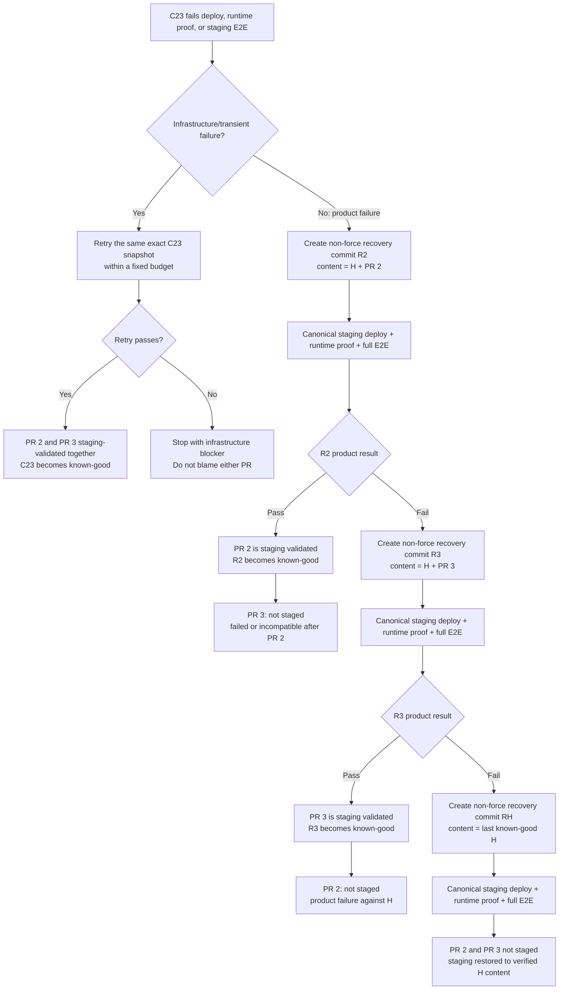

# 3. Staging failure reconciliation

Assume PR 1 already produced known-good staging content `H`. PR 2 and PR 3 have
the same final target, so they share the next snapshot
`C23 = H + PR 2 + PR 3`. The workflow first separates an infrastructure
failure from a product failure.

Each replay candidate gets the same bounded infrastructure retry treatment; an
infrastructure error never becomes evidence that a PR is faulty.

The order is the original accepted-request order, not an inferred priority from
the final target. If `H + PR 2` passes after `H + PR 2 + PR 3` failed, the
minimal deterministic conclusion is that PR 3 failed or is incompatible with
the accepted PR 2 baseline. Deploy Hub does not spend another full cycle trying
PR 3 alone unless someone explicitly retries or reorders it.

If the shared target is Production, each surviving replay result becomes its
own exact production candidate. If the shared target is Staging, the survivor
simply stops after staging validation.
