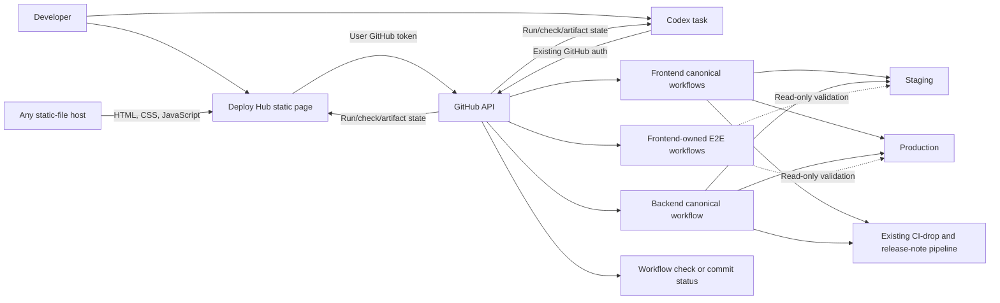

# Deploy Hub Architecture

Status: Agreed portable static MVP

Last updated: 2026-08-03

## Core boundary

Deploy Hub is plain static HTML, CSS, and JavaScript owned entirely by this
repository. A human uses the page; a Codex task uses its existing GitHub tools.
Both talk directly to GitHub and operate the same allowlisted canonical
workflows.

The static host serves files only. It may be `api.6529.io`, another internal
host, or any ordinary static host. Deploy Hub has no backend, API proxy,
Lambda, database, queue, scheduler, callback receiver, or reconciler.

The canonical source for this diagram is `diagrams/target-architecture.mmd`.

## Authentication

The browser stores the supplied GitHub token in its own origin's
`localStorage` and sends it only to `https://api.github.com`.

Authentication is deliberately small:

1. call GitHub `/user` and derive the login;
2. accept an active organization admin or active member of the existing
   deployment-operator team;
3. show the resolved login;
4. provide a visible forget action; and
5. recheck action-specific repository permission before every later mutation.

The static bundle uses no third-party scripts, never logs the token, renders
untrusted values with text-only DOM APIs, and restricts network connections
with CSP. Codex requires no new auth flow because it already has GitHub auth.

## Source of truth

Deploy Hub reads existing sources instead of creating a ledger:

| Fact | Source of truth |
| --- | --- |
| PR and exact head SHA | GitHub Pull Request |
| CI/review readiness | Existing GitHub checks and reviews |
| Deployment execution, waiting, logs, cancel, retry | Canonical GitHub Actions run |
| Actual deployed identity | Repository workflow evidence and runtime-version proof |
| Baseline E2E | Frontend-owned E2E workflow run and snapshot evidence |
| CI drop and release note | Existing communication pipeline and available link/outcome |

The GitHub workflow run ID/URL is the operation identity. An operation ID is
only correlation metadata placed in fixed workflow inputs or run metadata.
Page reload and polling reconstruct the current view directly from GitHub.

## GitHub operation boundary

There is no Deploy Hub HTTP API. Static UI modules and agent commands issue the
smallest fixed GitHub API requests needed for the current task:

- resolve identity and permission;
- resolve pull request, exact SHA, refs, and canonical workflow;
- dispatch or observe an allowlisted workflow;
- integrate the approved frontend staging ref through a non-force GitHub path;
- find the exact correlated run;
- read run/check/artifact evidence; and
- cancel or retry that exact run.

Every mutation fixes the repository, workflow/ref, environment, and input
shape in code. It rechecks current authority and exact source immediately
before mutation. Production is a separate explicit action.

Client checks are not security controls. GitHub repository permissions and the
canonical workflow/ref/environment protections are the authoritative mutation
boundary, including when a caller bypasses the page.

The agent surface is one small command or skill in this repository that uses
Codex's existing GitHub authentication and the same fixed operations. It does
not call the browser or introduce another runtime.

## Canonical adapters

| Component | Environment | Canonical entry point |
| --- | --- | --- |
| Frontend | Staging | Non-force integration into `1a-staging`; push triggers `deploy-staging.yml` |
| Frontend | Production | `build-upload-deploy-prod.yml` from exact current `main` |
| Backend | Staging | `deploy.yml` with exact SHA and selected services |
| Backend | Production | `deploy.yml` with exact current `main` SHA and selected services |

Deploy Hub supplies exact intent and observes these workflows. It never copies
their build, packaging, AWS deployment, health check, version proof,
notification, or release-note implementation.

## Concurrency and waiting

Canonical GitHub Actions concurrency owns conflicting mutations. Groups should
be scoped so frontend activity does not globally block unrelated backend work
and staging does not block production.

Deploy Hub has no queue ownership, claims, acceptance sequence, heartbeat,
lock recovery, or scheduler. The UI shows GitHub's queued or running state and
links the exact run. Because GitHub's run API does not expose a dependable
concurrency group or queue cause, the UI labels queued runs `Queued in GitHub
Actions` rather than inventing a more specific reason.

E2E records the environment versions before and after the suite. Snapshot
drift produces a stale result and rerun; Deploy Hub does not create a
cross-repository environment lock.

## UI delivery and updates

The page is a self-contained static release from one `deploy-hub` commit. It
displays its source version and works independently of the chosen static host.

After authentication, the page polls GitHub at least every five seconds for
relevant workflow state. Each complete read replaces the displayed view, so a
failed poll needs no cursor, event replay, or resynchronization protocol.

The UI shows current versions, recent and waiting workflows, exact SHA and PR,
elapsed time, concise failure, validation result, and GitHub/communication
links. Rolling ETA analytics are later work.

## Validation and coordinated changes

Every requested staging and production outcome retains the baseline read-only
E2E requirement after health and exact-version proof. The frontend repository
owns the Playwright workflows.

For coordinated frontend/backend work, the Codex task deploys the intended
components and triggers one E2E workflow against the final snapshot. The same
run link is reported for each participating change. No validation database or
state machine exists.

## PR feedback and communications

Use the existing workflow check first, then at most one commit status if the
existing check is insufficient. A GitHub App Check Run requires separate
evidence and approval.

Canonical workflows keep using the existing CI-drop and release-note pipeline.
Deploy Hub displays available links/outcomes and does not mirror that pipeline
or make communications a deployment gate.

## Recovery

Reloading the page or rerunning an agent lookup reads GitHub again. Cancel and
retry target the exact workflow run after fresh authorization and identity
checks. Retry never substitutes a newer SHA.

Known-good rollback remains an explicit canonical redeployment. Direct
canonical workflow use remains the break-glass fallback.

## Explicit MVP exclusions

- A Deploy Hub backend, proxy API, Lambda, container, database, Git state
  branch, queue, scheduler, lock service, callback receiver, or reconciler.
- Release trains, autonomous candidate discovery, claiming, or batching.
- OAuth, wallet auth, PKCE, refresh grants, GitHub App token brokering, shared
  service tokens, callbacks, SSE, or WebSockets.
- A separate validation state machine, release-note mirror, or analytics
  subsystem.
- Deploy Hub-owned build, AWS deployment, E2E, notification, or release-note
  implementation.
- Automatic rollback or transactional cross-repository releases.
