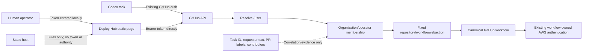

# Deploy Hub Authentication, Permissions, and Threat Model v1.2

Status: Accepted; portable static app per ADR 0005

Date: 2026-08-03

## 1. Boundary

Deploy Hub has no authentication server or backend. The static page uses the
operator's existing GitHub token directly against GitHub. Codex uses the
GitHub authentication already available in its task environment.

The non-negotiable rules are:

1. GitHub derives identity from `/user`; the caller cannot assert a login.
2. Current organization/operator permission is checked before access.
3. Every mutation rechecks the action-specific repository permission, exact
   SHA, target, and fixed allowlist immediately before the GitHub action.
4. Production is a separate explicit action and is never inferred.
5. Tokens never enter URLs, rendered text, logs, errors, fixtures, workflow
   inputs, artifacts, or durable state.
6. Deploy Hub invokes repository-owned workflows and never receives AWS
   credentials.
7. Static-page checks are not trusted as authorization; GitHub and canonical
   workflow/ref/environment protections enforce every real mutation.

## 2. Trust boundaries

The canonical diagram is `diagrams/security-trust-boundaries.mmd`.

The static host is not trusted with deployment authority. It serves the same
public static bytes to every user and never receives the GitHub token from
application code.

## 3. Browser authentication flow

1. The first-party static page loads without operational data or secrets.
2. The user enters a GitHub token.
3. The page sends `Authorization: Bearer <token>` directly to
   `https://api.github.com/user`.
4. The page verifies active `6529-Collections` administrator status or active
   membership in the existing deployment-operator team.
5. The page displays only the resolved login and stores the token under its own
   origin in `localStorage`.
6. The visible forget action removes the token.

Missing, invalid, revoked, inaccessible, insufficiently scoped, and
non-operator tokens fail before any later action becomes available.

## 4. Browser protections

- No third-party scripts, packages, analytics, fonts, or dynamic HTML.
- CSP permits scripts/styles only from the static origin and API connections
  only to GitHub for the authentication slice.
- Referrer policy is `no-referrer`.
- GitHub and workflow values are rendered through text-only DOM properties.
- Errors are fixed local messages; GitHub response bodies are not echoed.
- The token input is cleared after successful connection.
- The token is not placed in a URL, cookie, service worker, IndexedDB, console,
  exception message, or application state snapshot.

The accepted `localStorage` tradeoff means any future XSS is a token incident.
Every UI dependency or new network origin therefore requires explicit review.

## 5. Authorization policy

| Action | Minimum decision |
| --- | --- |
| Connect UI | Valid GitHub identity plus current operator membership |
| Read repository/run state | Current visibility for the fixed repository |
| Request staging | Current operator membership and required repository permission |
| Request production | Same checks, explicit production action, exact current `main` SHA |
| Update integration ref | Fixed repository/ref and fresh non-force head check |
| Dispatch workflow | Fixed repository/workflow/ref/input contract |
| Cancel or retry | Same current permission plus exact correlated run/SHA |

No UI field accepts an arbitrary repository, workflow path, ref, environment,
service, callback URL, contributor list, or AWS target.

## 6. Codex

Codex uses its existing GitHub authentication and the same fixed GitHub
operation contract. A task ID, prompt, branch, or PR ownership is correlation
only and never grants deployment authority.

There is no Deploy Hub OAuth flow, API token, browser-to-agent credential
transfer, shared `codex_service` secret, or MCP authorization server.

## 7. Hosting

Any ordinary static host may serve Deploy Hub. Hosting through `api.6529.io` is
one option, not a dependency. The host supplies files only and is never asked
to authenticate, authorize, proxy GitHub, store operational state, or perform
deployment actions.

## 8. Threat review

| Threat | Minimum mitigation | Failure behavior |
| --- | --- | --- |
| Invalid/revoked token | Verify directly with GitHub | Signed out; no mutation |
| Caller claims another login | Always use `/user` result | Claim ignored |
| Non-operator token | Current organization/team check | Signed out; no mutation |
| Token lacks required repo scope | Per-action GitHub permission check | Action denied |
| Token exposed by XSS | First-party static bundle, CSP, no third parties, safe DOM, forget/revoke | Revoke token and halt UI release |
| Token in error/log | Fixed local errors and token-canary tests | Fail release and rotate token |
| Arbitrary workflow/ref/repo | Constants and route-specific validation | Reject before GitHub mutation |
| Prompt requests production | Explicit production control and current checks | No production mutation |
| Moved source | Immutable SHA and final ref recheck | Mark stale; never substitute |
| Duplicate request | Search correlated exact run; canonical workflow concurrency | Return existing run or reject |
| Stale UI | Five-second GitHub polling and full view replacement | Next poll repairs view |
| Static host compromise | CSP, source version visibility, rollback to known commit | Stop using compromised release and revoke token |
| Static page bypass | GitHub permissions plus canonical workflow/ref/environment enforcement | Direct unauthorized dispatch fails before mutation |

Security ambiguity never becomes success.

## 9. Pre-mutation gate

Before each new action type becomes live:

- its GitHub repository, endpoint, workflow/ref, inputs, and permissions are
  fixed and documented;
- direct API/workflow dispatch cannot bypass the same mutation policy;
- the action rechecks operator and exact source immediately before mutation;
- invalid, revoked, non-operator, arbitrary-target, moved-SHA, and
  staging-to-production cases fail first;
- a token-canary test proves no credential reaches visible/durable surfaces;
  and
- the canonical manual workflow remains usable.

No backend, proxy, Lambda, OAuth service, GitHub App broker, callback identity,
WebSocket, or AWS role is approved by this gate.
