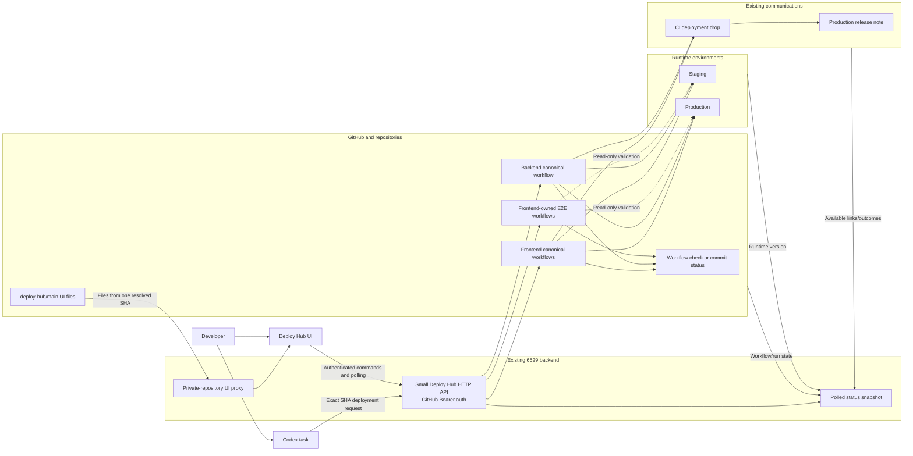

# Deploy Hub Architecture

Status: Agreed simplified MVP

Last updated: 2026-08-03

## Core boundary

The Codex task owns the feature lifecycle. Deploy Hub starts and observes one
exact repository deployment through the repository's canonical workflow. It
does not discover candidates, create release trains, build artifacts, deploy to
AWS itself, or maintain a second release state machine.

The existing 6529 backend owns the small authenticated HTTP boundary. The
`deploy-hub` repository owns the static UI, documentation, and any small pure
helpers that remain useful. The MVP does not deploy another server, Lambda,
container, database, queue, scheduler, or reconciler.

The rejected loopback server and event/ledger prototypes have been removed
from the active repository. Git history preserves them; live code must not
reintroduce or extend them.

The canonical source for this diagram is `diagrams/target-architecture.mmd`.



## Source of truth

Deploy Hub reads existing authoritative sources instead of creating a new
ledger:

| Fact | Source of truth |
| --- | --- |
| PR and exact head SHA | GitHub Pull Request |
| CI/review readiness | Existing GitHub checks and reviews |
| Deployment execution, queue, logs, cancellation and retry | Canonical GitHub Actions workflow run |
| Actual deployed identity | Runtime version endpoint or existing infrastructure proof |
| Baseline E2E execution | Frontend-owned E2E workflow run and its snapshot evidence |
| PR progress | Existing workflow check or one commit status; use a Check Run only if proven necessary |
| CI drop and release note | Existing backend communication pipeline and published links |

The operation ID is correlation metadata included in allowlisted workflow input
and visible run metadata. The API returns the GitHub run ID/URL. Agents and the
UI recover status using that operation ID or run ID.

There is no MVP `state/v1` branch, database, append-only event journal, global
sequence, snapshot cache, queue table, task callback store, or continuously
running reconciler. The retired prototype code and contracts are absent from
the active tree.

Duplicate detection is intentionally proportional: before dispatch, the API
looks for an existing matching operation/run; canonical workflow concurrency
and exact-SHA checks make accidental duplicate calls safe. Add stronger durable
idempotency only after a real duplicate cannot be handled safely this way.

## Authentication and authorization

Humans and Codex tasks use their existing GitHub token as a Bearer credential.
The backend resolves the token through GitHub `/user` and checks current
repository access and deployment-operator policy for every protected request.

The resolved GitHub login is the authenticated authority and GitHub executor.
The Codex task ID is requester/correlation metadata only. Production is a
separate explicit action and rechecks the current exact `main` SHA immediately
before dispatch.

No wallet OAuth, PKCE, refresh-token store, GitHub App token broker, callback
identity service, WebSocket authentication, or AWS credential is introduced.
Canonical workflows retain their existing cloud authentication.

## Agent-facing API

The MVP API is ordinary versioned HTTP in the existing backend:

```text
POST /deploy/hub/staging
POST /deploy/hub/production
GET  /deploy/hub/operations/:operationId
POST /deploy/hub/operations/:operationId/cancel
POST /deploy/hub/operations/:operationId/retry
POST /deploy/hub/validations
GET  /deploy/hub/snapshot
```

`POST /deploy/hub/validations` is a thin dispatch for the canonical E2E
workflow. Validation is not a second durable state machine: its state is the
E2E workflow run, and deployments link to that run.

Every mutation uses fixed repository, workflow, ref, environment, and backend
service allowlists. The API never accepts an arbitrary workflow path, callback
URL, AWS target, or contributor list.

## UI delivery and updates

The backend proxies the secret-free static UI from one resolved exact
`deploy-hub/main` SHA. Operational data and commands require the user's GitHub
Bearer token. The private-repository UI-read credential remains server-side and
is not deployment authority.

The open UI polls `GET /deploy/hub/snapshot` at least every five seconds and
uses conditional requests when nothing changed. Each response replaces the
view, so a failed poll needs no cursor, event replay, or resynchronization
protocol. Add SSE or WebSockets only if measured polling behavior is inadequate.

The UI shows current deployed versions, queued/running workflows, exact SHA and
PR, elapsed time, concise failure, validation result, and links to GitHub and
available communication outcomes. Rolling ETA analytics are later work.

## Canonical adapters

| Component | Environment | Canonical entry point |
| --- | --- | --- |
| Frontend | Staging | Non-force integration into `1a-staging`; push triggers `deploy-staging.yml` |
| Frontend | Production | `build-upload-deploy-prod.yml` from exact current `main` |
| Backend | Staging | `deploy.yml` with exact SHA and selected service |
| Backend | Production | `deploy.yml` with exact current `main` SHA and selected service |

Deploy Hub supplies exact intent and observes these workflows. It does not copy
their build, packaging, deployment, health-check, version-proof, notification,
or release-note implementation.

## Concurrency and waiting

Canonical GitHub Actions workflows own mutation concurrency. Concurrency groups
are scoped to the actual environment/component or backend service so frontend
work does not globally block unrelated backend work and staging does not block
production.

Deploy Hub does not implement queue ownership, claims, global acceptance order,
heartbeats, stale-lock recovery, or a scheduler. The UI reports GitHub's queued
or running workflow and the known concurrency group.

The baseline E2E workflow records the environment versions before and after the
suite. The MVP does not create a cross-repository environment lock. If another
deployment changes the environment during E2E, validation reports snapshot
drift and can be rerun; unrelated developers are not blocked by Deploy Hub.

## Validation

Every requested staging and production outcome retains the accepted baseline
read-only E2E requirement after health and exact-version proof. The frontend
repository owns the Playwright implementation and workflow.

For a single deployment, validation is the final phase of that operation. For
coordinated frontend/backend work, the Codex task deploys the intended
components in order and triggers one baseline E2E run against the final exact
environment snapshot. The same run link is reported for each participating
deployment.

A product failure is not automatically retried. A workflow/setup failure may be
rerun explicitly. Snapshot drift invalidates that validation result without
fabricating deployment failure or holding a custom lock.

## PR feedback

Use the smallest GitHub surface that meets the requirement:

1. retain the canonical workflow check and make its name/result useful;
2. add a commit status with a Deploy Hub/workflow link if another compact state
   is needed; and
3. introduce a narrow GitHub App Check Run only if the first two are proven
   insufficient.

PR feedback shows target environment, exact SHA, current phase, workflow link,
validation result, and terminal conclusion. It does not duplicate workflow
logs or every internal step.

## Deployment communications and release notes

Canonical repository workflows keep collecting exact contributor evidence and
posting to the existing backend CI-alert/release-note pipeline. Deploy Hub
passes the operation ID, GitHub authority, Deploy Hub origin, requester/task,
exact SHA/PR/environment, and selected services required by that pipeline.

Deploy Hub does not mirror the release-note queue or state machine. The UI and
agent status show a canonical link and a small available outcome such as
`pending`, `published`, `skipped`, or `failed`. Communication remains non-gating
for a healthy, exact, E2E-validated deployment.

## Shadow and rollout

Offline tests and deterministic fakes run first. If frontend Git integration
needs a real branch proof, `1a-deploy-hub` has one credentialless, opt-in shadow
workflow and cannot update shared refs, dispatch real deployments, access AWS,
or publish real deployment communications. It never becomes another staging
lane.

After shadow behavior is clear, use controlled low-risk shared-staging canaries
during a known clear window. Canonical manual deployment stays available and
Deploy Hub does not hold colleagues behind an experimental lock. Build separate
isolated cloud infrastructure only if a specific unsafe behavior cannot be
tested through fakes, dry runs, shadowing, or controlled staging.

## Recovery

The API and UI reconstruct status by reading GitHub workflow runs and runtime
truth. Cancel and retry call the existing GitHub Actions operations after
rechecking authorization and exact identity. A retry never silently substitutes
a newer SHA.

Known-good rollback remains an explicit canonical redeployment. Automatic
cross-repository rollback is not part of the MVP.

## Explicit MVP exclusions

- Release trains, candidate discovery, autonomous claiming, or batching.
- A Deploy Hub database, Git state branch, queue, scheduler, or reconciler.
- A second Deploy Hub backend runtime.
- A separate validation state machine.
- Mandatory callbacks, webhooks, task-event delivery, SSE, or WebSockets.
- GitHub Deployments or a GitHub App unless a concrete requirement proves them
  necessary.
- Deploy Hub-owned build, AWS deployment, E2E, notification, or release-note
  implementation.
- Automatic rollback or transactional multi-repository releases.
