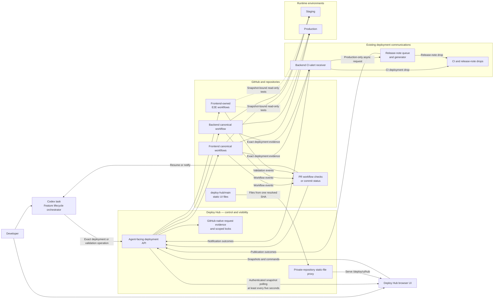

# Deploy Hub Architecture

Status: Agreed v1.0
Last updated: 2026-08-03

## Core boundary

The Codex task is the feature-lifecycle orchestrator. Deploy Hub accepts and
finishes one exact deployment or environment-snapshot validation operation.
Repository workflows execute builds, deployments, and baseline E2E. GitHub and
runtime version endpoints provide authoritative execution evidence. Existing
repository notifiers and backend services continue to own deployment drops and
production release notes.

The canonical source for the following diagram is
`diagrams/target-architecture.mmd`.



## Agent-owned production sequence

The canonical source for this diagram is
`diagrams/agent-to-production-sequence.mmd`.

```mermaid
sequenceDiagram
    actor D as Developer
    participant A as Codex task
    participant G as GitHub PR
    participant H as Deploy Hub
    participant W as Repository workflow
    participant E as Environment
    participant V as Frontend E2E workflow
    participant C as Existing communications pipeline

    D->>A: Work on this and see it through to prod
    A->>G: Implement and open or update PR
    G-->>A: Exact-head CI and review result
    A->>H: Deploy exact PR SHA to staging
    H->>G: Create or update staging PR feedback
    H->>W: Start canonical staging path
    W->>E: Deploy and health-check
    W->>C: Post exact staging deployment evidence
    C-->>W: CI-drop outcome; release note ineligible
    W-->>H: Deployed with exact runtime identity
    H->>E: Capture exact staging snapshot
    H->>V: Run mandatory staging baseline E2E
    V->>E: Execute read-only packs
    V-->>H: Terminal snapshot-bound result
    H->>E: Verify staging snapshot is unchanged
    H->>G: Conclude staging PR feedback
    H-->>A: Staging deployed and validated
    A->>E: Run additional feature validation when required
    A->>G: Merge exact approved result
    A->>H: Deploy exact main SHA to production
    H->>W: Start canonical production path
    W->>E: Deploy and verify version
    W->>C: Post exact production deployment evidence
    C-->>W: CI-drop and release-note enqueue outcomes
    Note over H,C: Release-note publication is observable but does not gate the environment
    W-->>H: Deployed with exact runtime identity
    H->>E: Capture exact production snapshot
    H->>V: Run mandatory production-safe E2E
    V->>E: Execute read-only packs
    V-->>H: Terminal snapshot-bound result
    H->>E: Verify production snapshot is unchanged
    H->>G: Conclude production PR feedback
    H-->>A: Production deployed and validated
    A-->>D: Feature is verified in production
    opt Later asynchronous communication outcome
        C-->>H: Release note published, skipped, or failed
        H-->>A: Non-gating communication event
    end
```

## State ownership

The custom `state/v1` ledger, separate validation lifecycle, and Deploy Hub
lock/queue mechanisms below are **not approved for live implementation** until
K1–K4 in `kiss-architecture-review.md` are resolved. Task 6 proved a
credentialless prototype. The KISS default is to use canonical workflow runs,
PR status/check evidence, GitHub concurrency, and runtime-version proof first.

### Authoritative state

- Proposed Deploy Hub request, command, claim, event, and terminal truth: the
  protected `refs/heads/state/v1` Git ledger in the private Deploy Hub
  repository. This proposal is under the K1 live-use gate.
- Pull-request identity and head SHA: GitHub Pull Requests.
- CI and review readiness: GitHub checks and reviews.
- Deployment execution: canonical GitHub Actions workflow run.
- Baseline validation execution and evidence: frontend-owned GitHub Actions E2E
  workflow run bound to an exact environment snapshot.
- Optional deployment projection and recent history: GitHub Deployment and
  Deployment Status records, only if K4 proves canonical workflow history is
  insufficient.
- PR-visible progress: existing workflow check or commit status first; a narrow
  Check Run only if Task 9 proves it necessary.
- Actual deployed identity: environment-specific runtime version endpoint or
  infrastructure version identifier.
- Deployment-drop and release-note truth: the existing backend CI-alert
  receiver, release-note queue/generator, deduplication evidence, and published
  drops.

### Minimal Deploy Hub state

Deploy Hub may persist only what cannot be derived reliably:

- Request ID and immutable payload.
- Requester and originating task reference.
- Waiting order when a target is busy.
- Idempotency evidence.
- Cancellation intent not yet reflected in a workflow.
- Validation ID, immutable environment snapshot, pack policy, and links to the
  linked deployment and E2E runs.
- Communication identity and links to the exact notification, queue/generator
  outcome, and published drop when available.

The Task 6 prototype stores these records as immutable requests and append-only
event files on a proposed protected `refs/heads/state/v1` branch. No live branch
exists. Before retaining it, the implementation must prove why workflow run
IDs, exact SHAs, PR status/check evidence, canonical workflow concurrency, and
runtime proof cannot satisfy the MVP. See `docs/contracts/README.md`, ADR 0006,
and K1–K4 in the KISS review. No database or S3 request ledger is added.

## UI delivery and live state

The UI has two deliberately separate paths:

```text
static code: browser → backend proxy → deploy-hub/main at one exact SHA
live data:   browser ↔ authenticated Deploy Hub API → GitHub/runtime truth
```

The backend resolves `deploy-hub/main` to an exact commit and proxies cached
HTML, CSS, and JavaScript from that commit. The static shell contains no
operational data or secret. The backend never exposes its private-repository UI
read credential to the browser and never mixes assets from different commits.
A merge to `deploy-hub/main` publishes a UI release without coupling it to a
backend repository deployment.

The browser sends the operator's GitHub Bearer token for operational API calls
and polls one authoritative snapshot endpoint at least every five seconds.
Each response replaces the current view, so a missed poll or server restart
needs no event replay or cursor repair. Conditional requests avoid transferring
unchanged payloads. CI-drop and release-note milestones appear in the same
snapshot without becoming deployment-state transitions. Commands remain
separate authenticated HTTP calls. A WebSocket or SSE transport is deferred
until measured polling behavior fails the UX or GitHub API budget.

## Authentication and permissions

Humans and Codex tasks use the GitHub authentication they already possess. The
API accepts the token as a Bearer credential, resolves the login through
GitHub, and checks current repository access and deployment-operator policy for
every protected call. The task ID is correlation, not authority. The browser
uses the existing deployment-UI pattern and may retain the token in
`localStorage` for the MVP.

The authenticated GitHub login is both deployment authority and GitHub
executor. All repository, workflow, ref, environment, and service targets are
server allowlisted and rechecked immediately before mutation. Production is a
separate explicit action. Deploy Hub does not create an OAuth server, wallet
role system, refresh-token store, GitHub App token broker, callback identity
service, or AWS credential path. It invokes and observes the existing canonical
workflows without redesigning their cloud authentication.

If Task 9 proves a narrow GitHub App capability is required for rich Check Run
writes, that projection-only permission receives a separate decision. It does
not become caller authentication or broad deployment authority.

The normative scopes, phase permission matrix, repository protections, secret
inventory, and threat review are in `security-model.md` and ADR 0007. The
standalone trust-boundary diagram is
`diagrams/security-trust-boundaries.mmd`.

## Deployment adapter mapping

| Component | Environment | Canonical entry point |
| --- | --- | --- |
| Frontend | Staging | Non-force integration into `1a-staging`, triggering `deploy-staging.yml` |
| Frontend | Production | `build-upload-deploy-prod.yml` from exact `main` |
| Backend | Staging | `deploy.yml` with exact SHA and one selected service per atomic request |
| Backend | Production | `deploy.yml` with exact `main` SHA and one selected service per atomic request |

## Deployment communications and release notes

Deploy Hub reuses the repository-owned pipeline analyzed in
`deployment-communications-analysis.md` and accepted in ADR 0005:

```text
canonical workflow
→ exact request, run, SHA, environment, PR, and service evidence
→ existing backend CI-alert receiver
→ CI deployment drop
→ production-only asynchronous release-note queue/generator
→ published, skipped, deduplicated, or failed release-note outcome
```

The Hub contributes immutable request identity, requester/task attribution, and
the GitHub login resolved from the caller token. Repository workflows retain
contributor evidence collection because the correct scope depends on
repository-specific PR, commit-range, and backend-service facts. The backend
retains rendering, profile mapping, release-note comparison, queueing,
deduplication, and publication.

Deployment authority, requester, and contributors are separate. `Deploy Hub`
is the operation origin, while the resolved GitHub login is the authenticated
authority and workflow actor. Neither is `Release Train`, and the system does
not invent another human identity. Contributor evidence failure omits the
contributor row with a diagnostic instead of guessing or preventing the CI
drop.

Communication outcomes are linked side effects, not deployment state-machine
terminals. The UI, PR feedback, audit history, and request lookup distinguish CI-drop
acceptance from release-note eligibility, enqueueing, skipping,
already-published, publication, and failure. A failure produces a visible
warning and recovery path but does not hold an environment lock or override
health, exact-version, and mandatory E2E truth.

## Environment-snapshot E2E

Deploy Hub creates one validation record only after every component intended
for the outcome is deployed. The record binds the environment, frontend
runtime SHA, backend runtime version per service, linked deployment request
IDs, E2E tooling SHA, and full baseline pack policy. A coordinated frontend and
backend outcome shares one record rather than running duplicate suites.

The frontend repository continues to own the Playwright implementation and E2E
workflows. Deploy Hub dispatches and observes all 12 current staging
post-deploy packs or all 11 current production-safe packs, verifies the exact
environment snapshot immediately before and after the run, and exposes the
result through the linked PR feedback, request status, and UI. Additional
feature-specific, authenticated, mutating, or deeper cross-system validation is
selected by the Codex task or policy and is not part of the universal baseline.

A product-test failure is terminal until an explicit retry or corrective
deployment. A retryable workflow or setup failure may receive a bounded retry
under the same validation identity. Staging validation failure blocks that
result from production. Production validation failure blocks later production
mutation until reconciliation, explicit acceptance, or exact known-good
redeployment.

## Shadow validation topology

Frontend control-plane validation uses `1a-deploy-hub` as a non-production
integration branch that mirrors how exact PR changes are incorporated into
`1a-staging` without invoking the real staging workflow.

```text
explicitly allowlisted frontend PR
→ integrate exact head into 1a-deploy-hub
→ credentialless deploy-hub-shadow workflow
→ build and simulate operation states
→ project UI, PR feedback, idempotency, and status-recovery behavior
```

The shadow workflow has no staging or production AWS credentials, cannot update
`1a-staging` or `main`, and cannot dispatch canonical deployment workflows.
Initial shadow results remain inside Deploy Hub; PR feedback is written only to
explicitly opted-in test PRs after its projected payload is verified.

Backend shadow validation normally dispatches a credentialless simulation for
the exact PR SHA and selected services. It does not require an integration
branch because the canonical backend operation is already exact-SHA and
dispatch-based.

This topology validates Git composition, request identity, waiting,
idempotency, state projection, failures, retries, cancellations, and agent
status recovery. It cannot validate AWS mutation, runtime health, rollback, or
actual shared-environment concurrency; those remain isolated-environment and
canary tests.

## Concurrency model

Concurrency is attached to actual mutation resources, not to a global release
train. Staging and production each receive a separate short-lived validation
lock while an exact snapshot is verified and baseline E2E runs. That lock
blocks mutation only to the same environment; it does not block the other
environment, PR CI, non-mutating preparation, or unrelated agent work.

## Multi-repository features

A coordinated feature is a plan held by the Codex task containing multiple
independent deployment operations and explicit ordering. Deploy Hub may display
and link them, but it does not convert them into an immutable global train.

Example:

```text
backend staging operation
→ backend health check
→ frontend staging operation
→ frontend health check
→ one mandatory E2E validation of the resulting staging snapshot
→ additional feature validation when required
```

## Recovery model

Deploy Hub reconstructs operation results from GitHub and runtime truth after an
interruption. Polling and explicit status lookup are sufficient for the MVP;
callbacks are not assumed. Retry preserves the same logical request identity
and never silently substitutes a newer mutable branch head.

For MVP rollback, the owning agent or operator selects a known-good exact
version and invokes the repository-owned canonical workflow. Automatic
component rollback remains later work until those repository primitives are
proven safe.
