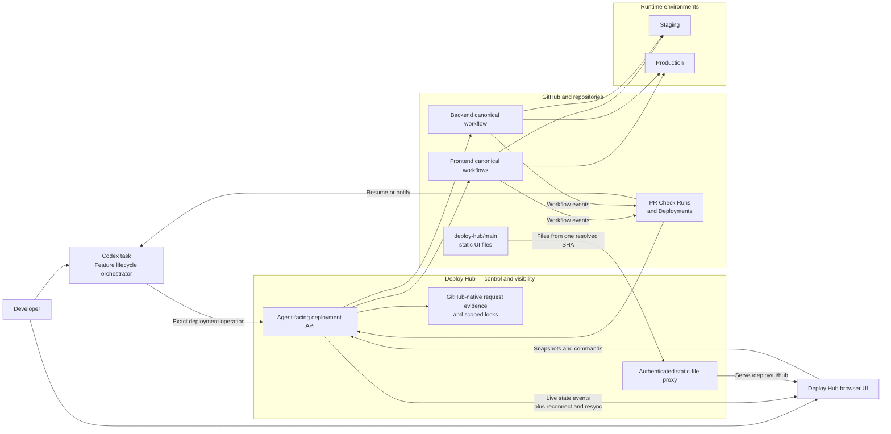
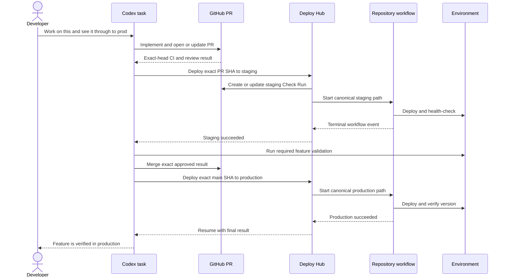

# Deploy Hub Architecture

Status: Draft v0.1
Last updated: 2026-08-03

## Core boundary

The Codex task is the feature-lifecycle orchestrator. Deploy Hub accepts and
finishes one exact deployment operation. Repository workflows execute builds
and deployments. GitHub and runtime version endpoints provide authoritative
execution evidence.

The canonical source for the following diagram is
`diagrams/target-architecture.mmd`.



## Agent-owned production sequence

The canonical source for this diagram is
`diagrams/agent-to-production-sequence.mmd`.



## State ownership

### Authoritative state

- Pull-request identity and head SHA: GitHub Pull Requests.
- CI and review readiness: GitHub checks and reviews.
- Deployment execution: canonical GitHub Actions workflow run.
- Deployment history: GitHub Deployment and Deployment Status records.
- PR-visible progress: GitHub Check Run.
- Actual deployed identity: environment-specific runtime version endpoint or
  infrastructure version identifier.

### Minimal Deploy Hub state

Deploy Hub may persist only what cannot be derived reliably:

- Request ID and immutable payload.
- Requester and originating task reference.
- Waiting order when a target is busy.
- Idempotency evidence.
- Cancellation intent not yet reflected in a workflow.

The MVP uses GitHub-native records for durable evidence and reconstructs state
from GitHub and runtime truth. It does not add a database or S3 request ledger.
The exact GitHub representation for waiting order and idempotency must be
validated during implementation design. A database-backed release state
machine remains explicitly excluded.

## UI delivery and live state

The UI has two deliberately separate paths:

```text
static code: browser → backend proxy → deploy-hub/main at one exact SHA
live data:   browser ↔ authenticated Deploy Hub API → GitHub/runtime truth
```

The backend authenticates `/deploy/ui/hub`, resolves `deploy-hub/main` to an
exact commit, and proxies cached HTML, CSS, and JavaScript from that commit. It
never exposes its private-repository credential to the browser and never mixes
assets from different commits. A merge to `deploy-hub/main` publishes a UI
release without coupling it to a backend repository deployment.

After loading an authoritative snapshot, the browser subscribes to a
server-sent event stream. State transitions, new requests, queue changes,
blockers, validation ownership, and deployed-version changes are emitted as
events. HTTP remains the command path for retry and cancellation. On
disconnect, the browser reconnects and reloads a snapshot before applying new
events. Bounded automatic polling is the fallback, so a transport interruption
never makes manual browser refresh part of normal operation.

## Authentication and permissions

An organization-owned GitHub App authenticates control-plane activity. Its
first shadow installation is physically read-only. Contents read, Check Run
write, workflow dispatch, repository mutation, and environment authority are
separate permissions introduced only when the rollout phase needs each one.

## Deployment adapter mapping

| Component | Environment | Canonical entry point |
| --- | --- | --- |
| Frontend | Staging | Non-force integration into `1a-staging`, triggering `deploy-staging.yml` |
| Frontend | Production | `build-upload-deploy-prod.yml` from exact `main` |
| Backend | Staging | `deploy.yml` with exact SHA and selected services |
| Backend | Production | `deploy.yml` with exact `main` SHA and selected services |

## Shadow validation topology

Frontend control-plane validation uses `1a-deploy-hub` as a non-production
integration branch that mirrors how exact PR changes are incorporated into
`1a-staging` without invoking the real staging workflow.

```text
explicitly allowlisted frontend PR
→ integrate exact head into 1a-deploy-hub
→ credentialless deploy-hub-shadow workflow
→ build and simulate operation states
→ project UI, Check Run, idempotency, and callback behavior
```

The shadow workflow has no staging or production AWS credentials, cannot update
`1a-staging` or `main`, and cannot dispatch canonical deployment workflows.
Initial shadow results remain inside Deploy Hub; Check Runs are written only to
explicitly opted-in test PRs after their projected payloads are verified.

Backend shadow validation normally dispatches a credentialless simulation for
the exact PR SHA and selected services. It does not require an integration
branch because the canonical backend operation is already exact-SHA and
dispatch-based.

This topology validates Git composition, request identity, waiting,
idempotency, state projection, failures, retries, cancellations, and agent
callbacks. It cannot validate AWS mutation, runtime health, rollback, or actual
shared-environment concurrency; those remain isolated-environment and canary
tests.

## Concurrency model

Concurrency is attached to actual mutation resources, not to a global release
train. Shared integration testing receives a separate short-lived lock when the
complete staging environment must remain unchanged.

## Multi-repository features

A coordinated feature is a plan held by the Codex task containing multiple
independent deployment operations and explicit ordering. Deploy Hub may display
and link them, but it does not convert them into an immutable global train.

Example:

```text
backend staging operation
→ backend health check
→ frontend staging operation
→ shared integration validation
```

## Recovery model

Deploy Hub reconstructs operation results from GitHub and runtime truth after an
interruption. It does not assume that a callback is the only evidence of
completion. Retry preserves the same logical request identity and never silently
substitutes a newer mutable branch head.

For MVP rollback, the owning agent or operator selects a known-good exact
version and invokes the repository-owned canonical workflow. Automatic
component rollback remains later work until those repository primitives are
proven safe.
