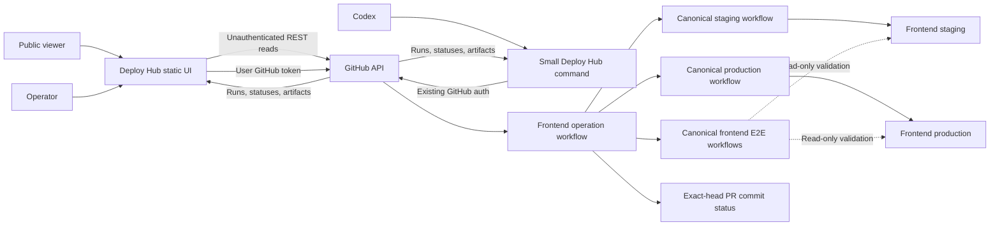

# Frontend Deploy Hub Architecture

Status: Accepted FE-only MVP

Last updated: 2026-08-06

## Boundary

Deploy Hub is a static browser app plus one small agent-facing command in this
repository. Both talk directly to GitHub using the caller's existing GitHub
authentication.

The frontend repository owns a thin operation workflow because its GitHub
permissions and protected refs must authorize real frontend mutations. That
workflow composes exact requests and calls the repository's existing canonical
deployment and E2E implementations. Deploy Hub never receives AWS credentials
or duplicates deployment logic.

The first implementation is the Task 1 FE dry-run workflow. It is dormant
unless explicitly dispatched, uses the frontend repository's automatic
`GITHUB_TOKEN`, and receives only repository, PR, and check read access plus
permission to write its clearly labelled dry-run commit status. It evaluates
the real candidate plan but has no ref, Actions-dispatch, environment, or OIDC
authority. Task 3 separately adds real staging behavior.

## Operation identity

The request freezes PR number, exact PR-head SHA, final target, requester, and
request time. The immutable cohort manifest is carried by the workflow. GitHub
run IDs and exact-head commit statuses provide durable correlation and
progress; there is no Deploy Hub operation database.

## Target-aware cohorts

At the start of its turn, the staging controller freezes valid pending requests
in accepted order. Adjacent requests with the same final target form a cohort.
A change in final target starts the next cohort.

Examples:

- `PR 2 → Production`, `PR 4 → Production`, `PR 5 → Staging` becomes production
  cohort `[2, 4]`, then staging cohort `[5]`.
- `PR 2 → Production`, `PR 3 → Staging`, `PR 4 → Production` remains three
  cohorts. PR 4 does not overtake PR 3.

This permits useful same-target batching without mixing production evidence
with staging-only work or recreating a release train.

## Latest-main staging composition

Each new staging candidate is rebuilt from one frozen current `main`, every
still-active tracked exact PR already accepted in staging, and the new cohort.
The controller does not merge `main` into a contributor's branch and does not
use the previous `1a-staging` tree as an opaque base. This keeps current main
content while preserving earlier staged PRs.

Deploy Hub records the active exact PR composition in bounded commit metadata.
If `1a-staging` has no such metadata, its tree is accepted as an initial
baseline only when it matches current `main`; otherwise live mutation fails
closed. The dry run reports this as `baselineRequired` without changing the
branch or environment.

## Concurrency

- One staging cohort owns the frontend staging mutation lane at a time.
- The currently frozen manifest may contain several ordered cohorts.
- New requests arriving after the freeze remain pending for the next manifest.
- Production and staging use independent concurrency lanes.
- When a production cohort passes staging, production continuation may proceed
  while the staging lane handles the next cohort.
- GitHub Actions owns waiting. Deploy Hub owns no locks, leases, heartbeats, or
  custom queue service.

## Canonical workflow reuse

The operation workflow supplies exact identity, ordering, and status. Existing
frontend workflows continue to own checkout, build, AWS mutation, health,
runtime proof, E2E, CI notification, and release notes.

For workflow-created `1a-staging` commits, the operation cannot assume that its
own `GITHUB_TOKEN` push will recursively trigger another workflow. The
canonical staging implementation therefore needs a reusable exact-SHA entry
point while retaining its ordinary manual/push path.

## Failure paths

Staging infrastructure failures retry the same snapshot within a bounded
budget. Product failures enter the finite ordered replay documented in
[the staging reconciliation flow](flows/03-staging-failure-reconciliation.md).
Recovery creates new non-force commits whose content represents the frozen
current `main`, retained tracked PRs, and the selected candidate; it never
resets shared branch history.

Production does not use automatic replay. After `main` mutation, every failure
reports the exact merged SHA and runtime truth. Only an explicit retry of the
same SHA or separately authorized known-good deployment may proceed.

## UI projection

Signed-out access is a public read-only projection of the public frontend
repository. It uses only unauthenticated GitHub REST endpoints, polls every five
minutes, shows the two environments and recent workflow activity, and exposes
no mutation controls. It deliberately omits the exact queued-PR count because
that durable status projection requires authenticated GitHub reads.

After GitHub authentication, the static page uses the caller's authenticated
API allowance. Valid non-operators remain read-only; verified organization
admins or operator-team members additionally receive mutation controls. Each
complete read derives the current environments, active operation, pending
statuses, run phases, runtime proof, E2E, and recent history. A failed poll
leaves an existing complete snapshot marked stale. When no snapshot exists,
loaders resolve to an explicit rate-limit or availability state instead.

The UI is not an authorization boundary. GitHub repository permissions,
protected refs, workflow permissions, environments, and explicit production
checks must reject unauthorized direct calls even when the page is bypassed.

## KISS boundary

No Deploy Hub backend, proxy, Lambda, database, Git ledger, custom queue,
scheduler, callback, WebSocket, or SSE is part of the MVP. A finite workflow
branch that reconciles one failed staging cohort is not a continuously running
reconciler service.
