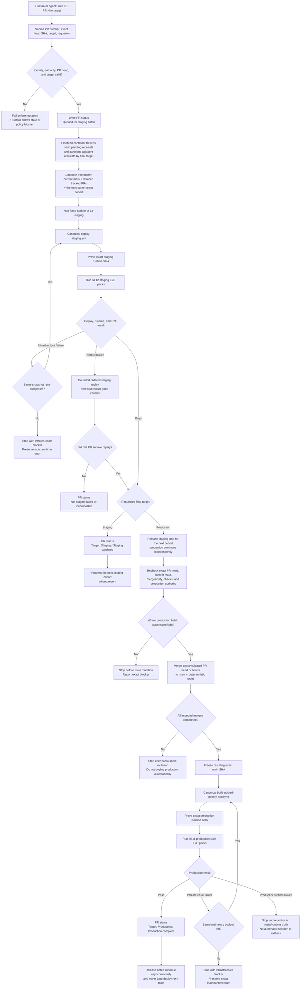

# 1. End-to-end frontend flow

This is the intended lifecycle of one explicit frontend request. Staging is
always the evidence gate; only a production target crosses into `main` and the
production workflow.

The feedback link always points to the authoritative workflow run. Deploy Hub
does not reimplement either frontend deploy workflow or either E2E suite.
