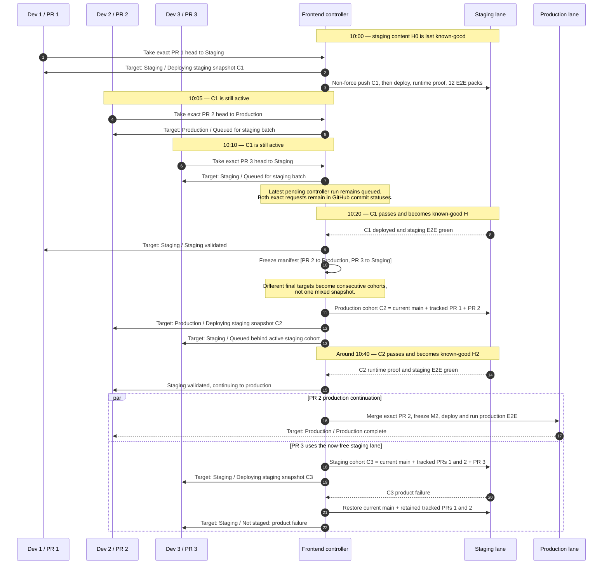

# 2. Staging batching timeline

Illustrative times show how requests wait without blocking the active deploy,
how same-target requests batch, and why a production-target PR is separated
from a staging-target PR.

GitHub Actions owns the single active frontend staging lane. There is no agent
waiting in a loop and no Deploy Hub queue database. A newer pending controller
run may replace an older pending controller run; the exact PR requests remain
discoverable from their commit statuses, so the next run freezes the complete
pending manifest.

If PR 2 and PR 3 had the same final target, they would form one cumulative
snapshot and follow Diagram 3 on failure. Here, different targets are kept
separate so faulty staging-only PR 3 cannot contaminate PR 2's production
evidence or delay its production continuation.
