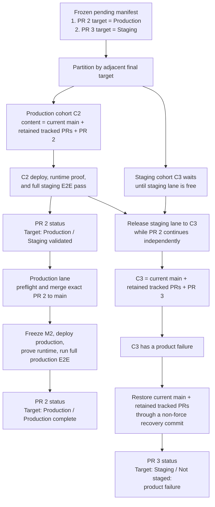
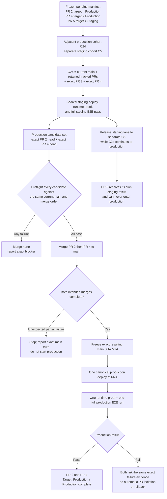

# 4. Mixed targets and production batching

## Example A — PR 2 targets production; faulty PR 3 targets staging

Both targets require staging evidence, but they do not share one staging
snapshot. The frozen request manifest is partitioned into adjacent same-target
cohorts, then the staging and production lanes overlap safely.

PR 3 cannot contaminate PR 2's staging evidence, hold its production
continuation, or accidentally reach production. Once C2 passes, production and
the next staging cohort use independent concurrency lanes.

## Example B — two production PRs batch; staging-only PR stays separate

The production batch is one adjacent production-target cohort with one shared
passing staging snapshot. PR 5 is not part of that evidence or production
content. If a staging-target request sits between PR 2 and PR 4 in accepted
order, they become separate cohorts rather than allowing PR 4 to overtake it.
PRs validated in separate staging snapshots are never automatically recombined
for production.
