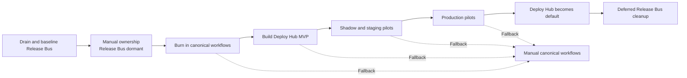

# Release Bus to Deploy Hub Migration Plan

Status: Draft v0.1
Last updated: 2026-08-03

## Migration principle

Release Bus is already OFF for staging and production and is not expected to be
re-enabled. Keep its code and infrastructure intact during Deploy Hub
development and burn-in, but use canonical repository workflows as the
operational fallback.

`Release Bus off` means its lanes no longer own or mutate environments. It does
not necessarily mean setting the raw Release Bus mode variable to the literal
value `OFF`. The existing manual workflows require a drained lane that reports
`ON = false` and `changeable = true`; a hard `OFF` fence may reject manual
deployment entirely.

The current authoritative controls and manual-workflow readiness still need to
be verified before implementation. Re-enabling Release Bus is not the rollback
plan. Deploy Hub must first be tested offline, then as a read-only shadow, then
against isolated execution infrastructure before any shared-staging canary.

## Phase 0 — Verify the current dormant baseline

- Confirm both Release Bus lanes are authoritatively OFF and cannot claim or
  mutate new work.
- Confirm no active train or ambiguous Release Bus operation remains.
- Record exact deployed frontend and backend versions in both environments.
- Record current `main` and `1a-staging` heads.
- Inventory current Release Bus triggers, credentials, AWS resources, tables,
  alarms, and workflow dependencies.
- Prove current manual/canonical workflow readiness without mutating
  production.
- Establish canonical manual workflows as the emergency deployment path.
- Document that re-enabling Release Bus is out of scope and would require a
  separate authoritative reconciliation and bootstrap if ever reconsidered.

Exit criteria:

- No active train or ambiguous external operation.
- Exact environment identity recorded.
- Manual canonical path is documented and authorized.

## Phase 1 — Preserve dormancy during development

- Keep staging and production under their current non-Release-Bus ownership.
- Keep candidate registration and autonomous lane claiming inactive.
- Retain the Release Bus API, database, reconciler code, and infrastructure.
- Retain manual-readiness endpoints while canonical workflows depend on them.
- Verify that scheduled reconciler invocations cannot mutate an environment.
- Confirm the Release Bus UI clearly reports that it is not the deployment
  owner.
- Do not use Release Bus as the fallback for Deploy Hub testing or rollout.

Exit criteria:

- Release Bus performs no new deployment mutation.
- Canonical manual workflows remain usable.

## Phase 2 — Canonical workflow burn-in

Exercise the normal repository paths without Deploy Hub orchestration:

- Frontend staging through `1a-staging` and `deploy-staging.yml`.
- Frontend production through `build-upload-deploy-prod.yml`.
- Backend staging through `deploy.yml`.
- Backend production through `deploy.yml`.
- Exact runtime version verification for every path.
- Manual retry and previous-version redeployment.
- Concurrent frontend and unrelated backend staging operations where safe.

Modify canonical workflows only where necessary to provide a stable generic
request ID, exact-SHA contract, terminal status output, and scoped concurrency.
Do not add Deploy Hub-specific build implementations.

Exit criteria:

- All four canonical adapters are proven independently.
- Release Bus is not needed to execute a normal deployment.

## Phase 3 — Build Deploy Hub MVP

- Create the dedicated Deploy Hub implementation repository.
- Implement the agent-facing operation contract.
- Implement exact-SHA, stale-head, authorization, and idempotency validation.
- Implement the four canonical workflow adapters.
- Add minimal durable request tracking and scoped waiting.
- Create GitHub Deployments and Check Runs.
- Emit terminal events carrying the originating Codex task reference.
- Build the operational UI and deployment history.
- Reconcile displayed state against GitHub and runtime version truth.

Explicit exclusions:

- Candidate discovery.
- Release trains.
- Arbitrary batching.
- Automatic main progression.
- Cross-repository rollback.
- A continuously running reconciler.

## Phase 4 — Shadow and staging pilot

- Run contract and failure tests against fake adapters.
- Create shadow requests for real PRs without dispatching deployment.
- Create a long-lived frontend `1a-deploy-hub` branch that mirrors
  `1a-staging` integration behavior but triggers only a dedicated credentialless
  shadow workflow.
- Allow only explicitly opted-in test PRs onto `1a-deploy-hub`; do not enroll
  colleagues' work automatically.
- Keep the shadow identity physically incapable of updating `1a-staging`,
  updating `main`, dispatching canonical deploy workflows, or assuming staging
  and production AWS roles.
- Shadow backend operations directly from exact PR SHAs using a credentialless
  simulation workflow unless a backend integration branch is later justified.
- Prove the shadow path before isolated execution. Treat shadow success as
  control-plane evidence only, not deployment evidence.
- Run controlled frontend and backend staging canaries.
- Prove frontend activity does not globally block unrelated backend work.
- Verify Check Run and UI state against the exact GitHub workflow and runtime.
- Test restart reconstruction and missed-callback recovery.
- Test duplicate, stale, cancellation, and bounded-retry behavior.

Exit criteria:

- No duplicate logical deployments.
- No successful status without exact runtime proof.
- No unexplained environment drift.
- No global FE/BE blocking outside an explicit shared validation window.
- No shadow identity possesses a shared-environment mutation capability.

## Phase 5 — Production pilot and establishment

- Run low-risk production pilots for frontend and backend.
- Route Codex deployment tools to Deploy Hub.
- Make Deploy Hub the normal deployment entry point.
- Keep canonical manual workflows as break-glass fallback.
- Disable the old Release Bus request UI and operator route.
- Complete an agreed burn-in covering all four deployment adapters and at least
  one stale, duplicate, failure, retry, and cancellation scenario.

Important limitation:

Once manual or Deploy Hub deployments mutate an environment, dormant Release
Bus state may no longer describe reality. The retained Release Bus code is not a
hot standby. Re-enabling it requires an explicit authoritative reconciliation
and bootstrap.

## Phase 6 — Deferred cleanup technical debt

This phase is part of the initial project scope but begins only after the
Deploy Hub acceptance gate.

- Export and retain required Release Bus audit history.
- Remove candidate, train, operation, manifest, lock, control, and UI routes.
- Remove the reconciler Lambda and scheduled triggers.
- Remove Release Bus-specific frontend workflows.
- Remove Release Bus-only inputs, authorization, and callbacks from canonical
  backend workflows.
- Remove Release Bus readiness dependencies from canonical manual workflows.
- Add cleanup migrations for obsolete tables; preserve historical migration
  files.
- Remove unused AWS resources, alarms, credentials, and GitHub App permissions.
- Remove obsolete operator skills, documentation, and terminology.
- Verify no production or staging path imports or calls Release Bus code.

## Migration diagram

The canonical source is `diagrams/migration-phases.mmd`.

