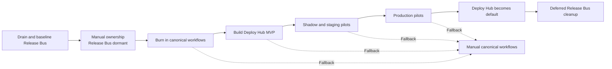

# Release Bus to Deploy Hub Migration Plan

Status: Draft v0.1
Last updated: 2026-08-03

## Migration principle

Release Bus is already OFF for staging and production and is not expected to be
re-enabled. Keep its code and infrastructure intact during Deploy Hub
development and burn-in, but use canonical repository workflows as the
operational fallback.

`Release Bus off` means its lanes no longer own or mutate environments. It does
not necessarily mean setting the raw Release Bus mode variable to the literal
value `OFF`. The existing manual workflows require a drained lane that reports
`ON = false` and `changeable = true`; a hard `OFF` fence may reject manual
deployment entirely.

The current authoritative controls and manual-workflow readiness still need to
be verified before implementation. Re-enabling Release Bus is not the rollback
plan. Deploy Hub must first be tested offline, then as a read-only shadow, then
against isolated execution infrastructure before any shared-staging canary.

## Phase 0 — Verify the current dormant baseline

- Confirm both Release Bus lanes are authoritatively OFF and cannot claim or
  mutate new work.
- Confirm no active train or ambiguous Release Bus operation remains.
- Record exact deployed frontend and backend versions in both environments.
- Record current `main` and `1a-staging` heads.
- Inventory current Release Bus triggers, credentials, AWS resources, tables,
  alarms, and workflow dependencies.
- Reinspect backend PR #1869 and frontend PR #3504, then trace the final
  canonical workflow → notifier → CI-alert receiver → release-note
  queue/generator path at the exact repository heads.
- Prove current manual/canonical workflow readiness without mutating
  production.
- Establish canonical manual workflows as the emergency deployment path.
- Document that re-enabling Release Bus is out of scope and would require a
  separate authoritative reconciliation and bootstrap if ever reconsidered.

Exit criteria:

- No active train or ambiguous external operation.
- Exact environment identity recorded.
- Manual canonical path is documented and authorized.

## Phase 1 — Preserve dormancy during development

- Keep staging and production under their current non-Release-Bus ownership.
- Keep candidate registration and autonomous lane claiming inactive.
- Retain the Release Bus API, database, reconciler code, and infrastructure.
- Retain manual-readiness endpoints while canonical workflows depend on them.
- Verify that scheduled reconciler invocations cannot mutate an environment.
- Confirm the Release Bus UI clearly reports that it is not the deployment
  owner.
- Do not use Release Bus as the fallback for Deploy Hub testing or rollout.

Exit criteria:

- Release Bus performs no new deployment mutation.
- Canonical manual workflows remain usable.

## Phase 2 — Canonical workflow burn-in

Exercise the normal repository paths without Deploy Hub orchestration:

- Frontend staging through `1a-staging` and `deploy-staging.yml`.
- Frontend production through `build-upload-deploy-prod.yml`.
- Backend staging through `deploy.yml`.
- Backend production through `deploy.yml`.
- Staging baseline E2E through the existing frontend-owned post-deploy workflow.
- Production baseline E2E through the existing frontend-owned production-safe
  workflow.
- Exact runtime version verification for every path.
- Exact environment-snapshot capture before and after every baseline E2E run.
- Manual retry and previous-version redeployment.
- Concurrent frontend and unrelated backend staging operations where safe.
- Operation-scoped CI deployment drops for all four canonical paths.
- Production-only release-note generation, including frontend/manual baseline
  transitions and backend multi-service grouping.
- Distinct observable outcomes for CI-drop acceptance, release-note
  eligibility, enqueueing, generation, deduplication, publication, and failure.

Generalize the two E2E workflows so a Deploy Hub validation identity and exact
environment snapshot replace Release Bus train and manifest assumptions. The
same generic validation path must support frontend-only, backend-only, and
coordinated outcomes. Preserve all 12 current staging post-deploy packs and all
11 current production-safe packs as the initial mandatory baselines.

Modify canonical workflows only where necessary to provide a stable generic
request ID, exact-SHA contract, terminal status output, and scoped concurrency.
Do not add Deploy Hub-specific build implementations.

Exit criteria:

- All four canonical adapters are proven independently.
- Both baseline E2E workflows can validate a generic exact environment snapshot
  without Release Bus ownership or callbacks.
- Canonical notifications attribute the authenticated authority, requester, and
  exact contributors separately without Release Bus train-wide scope.
- Production release-note automation succeeds from canonical workflow evidence
  and remains asynchronous and non-gating.
- Release Bus is not needed to execute a normal deployment.

## Phase 3 — Build Deploy Hub MVP

- Create the dedicated Deploy Hub implementation repository.
- During the owner-approved credentialless bootstrap, use audited direct pushes
  to `deploy-hub/main` after fresh remote-head checks. Reconsider protected-main
  and reviewed task branches before credentials, live permissions, deployment
  authority, or another write actor; create no live credential as part of
  skeleton work.
- Reuse the current deployment UI's GitHub Bearer-token authentication. Resolve
  the caller through GitHub `/user`, check current repository/operator policy,
  and expose separate explicit staging and production actions.
- Let Codex use its existing GitHub authentication through the same small HTTP
  API or a thin CLI helper. Add no OAuth server, PKCE flow, refresh-token store,
  wallet role mapping, or shared Codex service token.
- Keep the first browser flow equivalent to the existing internal deploy UIs:
  paste or reuse a GitHub token, store it locally, send it only as a Bearer
  header, and provide a visible forget action.
- Implement the agent-facing operation contract.
- Implement the environment-snapshot validation contract and lifecycle.
- Implement exact-SHA, stale-head, authorization, and idempotency validation.
- Implement the four canonical workflow adapters.
- Implement staging and production E2E adapters without copying Playwright into
  this repository.
- Add minimal durable request tracking and scoped waiting.
- Add independent staging and production validation locks that block only
  mutation to the environment being tested.
- Add the smallest PR feedback and GitHub operation links that meet the UX;
  assess workflow checks and commit statuses before richer projections.
- Emit terminal events carrying the originating Codex task reference.
- Add the backend private-repository proxy that resolves `deploy-hub/main` to
  one exact SHA and serves its secret-free static UI shell under
  `/deploy/ui/hub`; require GitHub Bearer auth for operational calls.
- Build the operational UI and deployment history in this repository.
- Deliver state, queue, blocker, and deployed-version changes by polling one
  authenticated snapshot endpoint at least every five seconds. Add no
  WebSocket, SSE, cursor, replay, or special transport credential until
  measurements show polling is insufficient.
- Prefer observing authoritative GitHub workflow/run state over introducing
  callbacks or webhooks. Add a verified callback contract only if polling
  cannot provide required evidence.
- Preserve the canonical workflows' existing AWS authentication. Deploy Hub
  neither receives AWS credentials nor redesigns that boundary in the MVP.
- Reconcile displayed state against GitHub and runtime version truth.
- Attach immutable GitHub authority, Deploy Hub origin, and requester context to
  canonical workflow notification evidence and observe the existing CI-drop
  and release-note pipeline without reimplementing it.
- Surface the smallest available communication summary in PR feedback, request
  lookup, history, and the UI while keeping it outside environment locks and
  deployment success gates.
- Resolve K1–K4 in `kiss-architecture-review.md`. Use canonical workflow runs,
  PR status/check evidence, GitHub concurrency, and runtime proof unless the
  review demonstrates that the proposed `state/v1` ledger or additional
  projections are necessary.
- Do not add a database or S3 request ledger without demonstrated need.

Explicit exclusions:

- Candidate discovery.
- Release trains.
- Arbitrary batching.
- Automatic main progression.
- Cross-repository rollback.
- A continuously running reconciler.

## Phase 4 — Shadow and staging pilot

- Run contract and failure tests against fake adapters.
- Use credentialless fakes and existing caller GitHub credentials for the
  smallest read-only shadow proof. Do not register a GitHub App merely to prove
  that a credentialless workflow cannot deploy.
- Create shadow requests for real PRs without dispatching deployment.
- Create a long-lived frontend `1a-deploy-hub` branch that mirrors
  `1a-staging` integration behavior but triggers only a dedicated credentialless
  shadow workflow.
- Allow only explicitly opted-in test PRs onto `1a-deploy-hub`; do not enroll
  colleagues' work automatically.
- Keep the shadow path physically incapable of updating `1a-staging`,
  updating `main`, dispatching canonical deploy workflows, or assuming staging
  and production AWS roles.
- Prove that boundary from the actual credential/workflow permission set; a
  software shadow flag does not count.
- Shadow backend operations directly from exact PR SHAs using a credentialless
  simulation workflow unless a backend integration branch is later justified.
- Route every shadow notification and release-note event to fake or suppressed
  sinks; shadow must be physically unable to publish real drops or notes.
- Prove the shadow path before isolated execution. Treat shadow success as
  control-plane evidence only, not deployment evidence.
- Run controlled frontend and backend staging canaries.
- Verify staging CI drops show the GitHub authority, Deploy Hub origin,
  requesting identity, and exact scoped contributors, and remain release-note-
  ineligible.
- Run the complete mandatory staging E2E baseline for frontend-only,
  backend-only, and coordinated exact snapshots.
- Prove that a coordinated deployment produces one linked validation rather
  than duplicate E2E runs.
- Exercise a product-test failure, a retryable workflow/setup failure, and a
  snapshot change during testing; verify each produces the specified truthful
  result.
- Prove frontend activity does not globally block unrelated backend work.
- Verify Check Run and UI state against the exact GitHub workflow and runtime.
- Verify that new operations and every queue or state transition appear in an
  already-open browser without manual refresh.
- Pause and resume snapshot polling; prove the next successful response repairs
  the view without event replay or stale state.
- Exercise invalid/revoked/non-operator GitHub tokens, explicit-production
  denial, moved refs, token leakage canaries, arbitrary workflow/ref attempts,
  and cross-repository escalation before a live canary.
- Test restart reconstruction and missed-observation recovery.
- Test duplicate, stale, cancellation, and bounded-retry behavior.

Exit criteria:

- No duplicate logical deployments.
- No successful status without exact runtime proof.
- No staging success without terminal snapshot-bound baseline E2E.
- No unexplained environment drift.
- No global FE/BE blocking; a validation window blocks mutation only to the
  same environment.
- No shadow identity possesses a shared-environment mutation capability.

## Phase 5 — Production pilot and establishment

- Run low-risk production pilots for frontend and backend.
- Require the complete production-safe E2E baseline against each resulting
  exact production snapshot before reporting success.
- Verify frontend and backend production CI drops and production release notes
  carry exact operation-/PR-/service-scoped attribution.
- Prove release-note publication success, duplicate suppression, explicit skip,
  and observable failure without blocking deployment or E2E completion.
- Exercise and reconcile a controlled production-validation failure without
  hiding the fact that deployment already occurred.
- Route Codex deployment tools to Deploy Hub.
- Make Deploy Hub the normal deployment entry point.
- Verify that a merge to `deploy-hub/main` publishes one internally consistent
  UI release without requiring a backend deployment.
- Keep canonical manual workflows as break-glass fallback.
- Disable the old Release Bus request UI and operator route.
- Complete an agreed burn-in covering all four deployment adapters and at least
  one stale, duplicate, failure, retry, cancellation, and snapshot-drift
  scenario.

Important limitation:

Once manual or Deploy Hub deployments mutate an environment, dormant Release
Bus state may no longer describe reality. The retained Release Bus code is not a
hot standby. Re-enabling it requires an explicit authoritative reconciliation
and bootstrap.

## Phase 6 — Deferred cleanup technical debt

This phase is part of the initial project scope but begins only after the
Deploy Hub acceptance gate.

- Export and retain required Release Bus audit history.
- Remove candidate, train, operation, manifest, lock, control, and UI routes.
- Remove the reconciler Lambda and scheduled triggers.
- Remove Release Bus-specific frontend workflows.
- Remove Release Train authority and train/operation notification contracts
  only after the canonical manual and authenticated GitHub-authority/Deploy-Hub
  origin paths preserve CI posting and release-note automation.
- Remove Release Bus-only E2E train/manifest inputs, authorization, and
  callbacks after the generic environment-snapshot paths are established.
- Remove Release Bus-only inputs, authorization, and callbacks from canonical
  backend workflows.
- Remove Release Bus readiness dependencies from canonical manual workflows.
- Add cleanup migrations for obsolete tables; preserve historical migration
  files.
- Remove unused AWS resources, alarms, credentials, and any later-added GitHub
  App permissions.
- Remove obsolete operator skills, documentation, and terminology.
- Verify no production or staging path imports or calls Release Bus code.
- Verify canonical Deploy Hub/manual deployment drops and production release
  notes still work after Release Bus-specific identities are removed.

## Migration diagram

The canonical source is `diagrams/migration-phases.mmd`.

