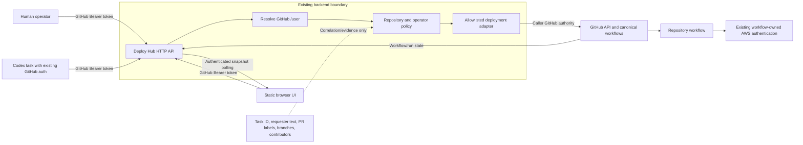

# Deploy Hub Authentication, Permissions, and Threat Model v1.1

Status: Accepted; simplified by ADR 0009

Date: 2026-08-03

## 1. Purpose and boundary

Deploy Hub reuses the authentication already proven by `/deploy/ui` and
`/deploy/ui/bus`. It does not introduce a wallet OAuth service, PKCE flow,
refresh-token store, browser session system, GitHub App token broker, workflow
callback identity service, or WebSocket authentication protocol.

Task 7 remains unstarted. This document changes its intended security boundary;
it creates no credential, permission, workflow, state branch, AWS role, or
deployment capability.

The non-negotiable rules are:

1. Every protected HTTP request carries a GitHub token in the Bearer header.
2. The backend derives the GitHub login from GitHub; the caller cannot assert
   its own authenticated identity.
3. The current GitHub login, repository access, and deployment-operator policy
   are checked before every mutation.
4. Production is a separate explicit action and is never inferred from staging
   intent, prior success, task metadata, a branch, or a prompt.
5. Tokens never enter durable records, UI payloads, PR feedback, workflow
   inputs, URLs, logs, errors, fixtures, or artifacts.
6. Deploy Hub invokes repository-owned canonical workflows. It does not acquire
   AWS credentials or replace workflow-owned cloud authentication.

## 2. Trust boundaries

The canonical diagram is `diagrams/security-trust-boundaries.mmd`.

## 3. Identity and attribution

| Identity | Meaning | Authoritative source |
| --- | --- | --- |
| requester | Human or Codex task asking for the operation | Request metadata plus task reference |
| authority | GitHub user whose token permits the action | GitHub `/user` response |
| workflow actor | Actor recorded by the exact canonical workflow run | GitHub run evidence |
| contributors | Humans proven to be in the exact deployed change | Repository-owned PR/commit evidence |

The same GitHub user may be authority and workflow actor. That does not make the
requester or contributors interchangeable. `Deploy Hub` is an operation origin
label, not a synthetic authenticated person. `Release Train` is never used for
a Deploy Hub operation.

The server enriches accepted requests with the resolved authority. It ignores
or rejects caller-supplied authority fields.

## 4. Authentication flow

### Humans and browser UI

1. The static first-party UI loads without operational data or secrets.
2. The operator supplies a GitHub token, matching the existing deployment UI.
3. The browser sends `Authorization: Bearer <token>` only to the Deploy Hub API
   origin over HTTPS.
4. The API calls GitHub `/user`, verifies required repository access, and
   checks the configured deployment-operator policy.
5. The UI may retain the token in `localStorage` for the MVP and provides a
   visible forget action that removes it.

The accepted local-storage tradeoff makes XSS prevention critical: the UI uses
only first-party static files, no third-party scripts, no dynamic HTML from
untrusted strings, a restrictive CSP, and no token-bearing URL.

### Codex and other agents

Codex uses the GitHub authentication already available to its task environment.
A small HTTP client or CLI helper supplies that token as a Bearer credential.
Task IDs, prompts, branches, and PR ownership are correlation data only.

No Deploy Hub-specific OAuth flow or static shared `codex_service` token exists.

## 5. Authorization policy

Authorization is checked on every request, not just when a UI connects.

| Action | Minimum decision |
| --- | --- |
| Read status/history | Valid GitHub identity plus required repository visibility |
| Request staging | Current deployment-operator membership and required repository permission |
| Request production | Current deployment-operator membership, required repository permission, explicit production endpoint/action, and exact current `main` SHA |
| Cancel or retry | Same current environment permission plus matching request/version |
| Update an integration ref | Current operator permission, allowlisted repository/ref, and fresh non-force head check |
| Dispatch a workflow | Current operator permission and exact allowlisted repository/workflow/ref/input contract |

Every mutation rechecks authority and exact source immediately before the
external GitHub action. A revoked or insufficient token fails before mutation.

No route accepts an arbitrary repository, workflow path, ref, environment,
service, callback URL, contributor list, or AWS target.

## 6. GitHub and workflow permissions

The caller token may perform only actions that both GitHub and Deploy Hub's
server-side allowlist permit. Required capabilities are introduced by the task
that uses them, not by a broad up-front credential registration.

Task 7 needs identity resolution and the minimum GitHub reads required by its
API contract. Later adapter tasks may use the caller token for existing
workflow dispatch, ref update, workflow observation, and cancellation paths.

Rich Check Run writes are not assumed. Before Task 9 introduces a GitHub App,
it must prove that the approved fine-grained caller token cannot provide the
required Check Run behavior and that simpler workflow checks or commit statuses
do not satisfy the PR-feedback requirement. Any App then owns that narrow
projection capability only; it does not replace caller authentication or gain
deployment/AWS authority by default.

Deploy Hub does not change the canonical workflows' AWS authentication in the
MVP. Workflow callbacks are not required where polling the authoritative
GitHub run and runtime evidence is sufficient.

## 7. UI delivery and updates

The backend proxies the static UI from one resolved `deploy-hub/main` SHA using
a server-held read credential or existing GitHub integration. That credential
is limited to reading UI files and is never sent to the browser.

The UI shell may load before user authentication, matching the existing deploy
UIs. Every operational snapshot and command requires the user's Bearer token.

The MVP polls an authenticated snapshot at intervals no longer than five
seconds. Polling stops when the page is not active if doing so does not violate
the no-manual-refresh requirement when focus returns. Retry and cancel are
ordinary HTTP commands. No WebSocket ticket, event cursor, replay channel, SSE
service, or push-transport credential exists unless polling proves inadequate.

## 8. Shadow and rollout permissions

Shadow safety is achieved with the smallest concrete capability boundary:

- offline tests use fakes and no credentials;
- read-only shadow uses a token or workflow token that cannot dispatch, update
  protected refs, access AWS, or publish real deployment communications;
- `1a-deploy-hub`, if concrete branch-trigger testing requires it, triggers
  only a credentialless simulation workflow;
- real staging and production authority is added only to the adapter and
  canonical workflow path that needs it;
- no software `shadow=true` flag is treated as the only safety boundary.

An organization GitHub App, isolated AWS account, new IAM role, or new secret
is not required merely to prove that a credentialless fake cannot deploy.

## 9. Secret handling

| Secret/capability | Holder | Rules |
| --- | --- | --- |
| User/agent GitHub token | Browser local storage or agent's existing GitHub auth store | Bearer header only; forget/revoke supported; never logged or persisted by Deploy Hub |
| UI proxy read credential | Existing backend secret/configuration | Read only from `deploy-hub`; never exposed to browser or operations API |
| Existing workflow/AWS credentials | Canonical repository workflow | Remain workflow-owned; Deploy Hub neither receives nor stores them |
| Existing CI-notification credential | Canonical workflow/backend receiver | Remains outside Deploy Hub records and UI |

Authorization and Cookie headers are never logged. Error serialization is
allowlist-based. Tests seed a fake token marker and prove it is absent from
responses, records, logs, PR feedback, and artifacts.

## 10. Threat review

| Threat | Minimum mitigation | Failure behavior |
| --- | --- | --- |
| Invalid/revoked GitHub token | Validate against GitHub and required access | `401/403`; no mutation |
| Caller claims another login | Ignore caller login; derive `/user` identity | `400/403`; no mutation |
| Prompt or task ID requests production | Explicit production action plus current operator check | `403`; no production dispatch |
| Token exposed by XSS | First-party static code, strict CSP, safe DOM APIs, no third-party scripts, forget/revoke | Revoke token; disable UI commands during incident |
| Token leaks through logs or records | Header redaction and allowlist serialization | Fail test/release; rotate leaked token |
| Arbitrary workflow/ref/repository | Typed allowlists and exact pre-mutation checks | `400/403`; alert on repeated attempts |
| Moved PR/main/ref | Immutable accepted SHA and fresh recheck | Mark stale; never substitute source |
| Cross-repository escalation | Fixed repository IDs and route-specific permissions | Deny before GitHub mutation |
| Duplicate request or retry | Search exact operation/run and rely on canonical workflow concurrency | Return the run or reject before a second mutation |
| Stale UI | Five-second polling and full snapshot replacement | Next successful poll repairs view |
| Excessive polling/rate exhaustion | One snapshot endpoint, ETag/conditional requests, page-visibility backoff, `429` handling | Visible degraded state; no mutation |
| Untrusted PR gains deployment secrets | Canonical workflow protections remain authoritative | Workflow refuses mutation |

Security ambiguity never becomes success.

## 11. Pre-live gate

Before Task 7 or any later task handles a real token or deployment action:

- exact routes and GitHub calls are allowlisted;
- required GitHub permissions are documented from observed endpoint responses;
- protected `deploy-hub/main` workflow is reconsidered;
- test tokens cannot reach logs, responses, records, or UI state;
- invalid, revoked, non-operator, staging-to-production, moved-SHA, arbitrary
  workflow, and cross-repository cases fail before mutation;
- manual canonical deployment remains available if Deploy Hub is unavailable.

No GitHub App, OAuth client, token broker, WebSocket authentication service,
callback identity service, or AWS role is approved by this gate.

## 12. Revisit triggers

See ADR 0009. Complexity may be added only for a measured limitation or a new
approved requirement.
