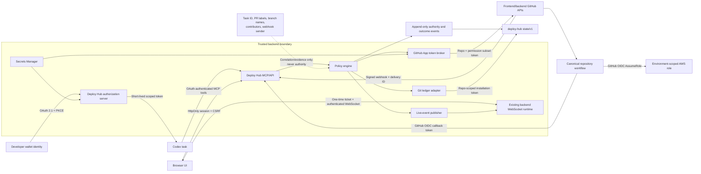

# Deploy Hub Authentication, Permissions, and Threat Model v1

Status: Accepted Task 3 security contract

Date: 2026-08-03

## 1. Purpose and safety boundary

This document defines who may ask Deploy Hub to act, which credential performs
each external action, how authority is reduced by rollout phase, and how the
system fails closed. It is normative for Tasks 4–25.

Task 3 creates no GitHub App, OAuth client, session key, webhook secret, state
branch, workflow, AWS role, environment, or deployment credential. Those
objects remain forbidden until their owning task and the credential gate in
this document are satisfied.

The model preserves four non-negotiable boundaries:

1. Deployment truth stays in the protected Git ledger, not an auth database.
   Standard OAuth grants, browser sessions, replay keys, and rate limits may use
   existing backend auth/Redis storage; they never become deployment truth.
2. The authenticated human/profile grants authority. A Codex task ID, branch,
   PR label, webhook sender, workflow actor, or contributor list never does.
3. Deploy Hub never gives a browser, Codex process, or workflow its GitHub App
   private key or a long-lived AWS credential.
4. A phase can perform only the actions for which it possesses a credential.
   A `shadow=true` flag is never a security boundary.

The canonical diagram source is
`docs/diagrams/security-trust-boundaries.mmd`.

## 2. Identity and trust model

| Identity | Trust and use | Never implies |
| --- | --- | --- |
| Wallet-authenticated profile | Human authority after server-side role/scope policy | PR authorship, contributor credit, or automatic production rights |
| Codex task requester | Correlation, lifecycle ownership, and callback target supplied through the MCP client | Cryptographic authority or proof of prompt text |
| OAuth client/session | A bounded channel for one authenticated profile and granted scopes | Permission beyond the profile role or token audience |
| Deploy Hub GitHub App | External executor that writes ledger/projections and dispatches allowlisted workflows | Human requester identity or contributor identity |
| GitHub workflow actor | Evidence of who/what started the exact run | Deployment authority unless the request and OIDC claims also match |
| GitHub webhook sender | Informational actor in a signed delivery | Permission to create a request or select production |
| CI-drop contributors | Repository-derived contributors to the exact deployment | Requester or production authority |
| Per-PR release-note contributors | Repository-derived evidence for each production PR | Train-wide or caller-supplied contributor truth |
| Break-glass operator | Separately authorized human using canonical manual workflow | Permission to rewrite ledger history or conceal manual action |

There is no assumed OpenAI-issued task attestation in v1. A caller may send a
task ID only after OAuth authentication, and the server records it as requester
metadata. A false task ID cannot change environment policy; callback routing
accepts only preconfigured integration destinations and never a caller-supplied
URL.

## 3. Caller authentication

### 3.1 Codex and other agents

The agent surface is a Streamable HTTP MCP server backed by the versioned Deploy
Hub HTTP/domain contracts.

Authentication flow:

1. Codex starts OAuth 2.1 authorization code with PKCE against the Deploy Hub
   authorization server.
2. The authorization UI completes the existing 6529 wallet login and resolves
   one profile ID and current Deploy Hub roles.
3. The server validates `state`, PKCE verifier, redirect URI, and requested
   scopes, then issues an authorization code usable once.
4. The client exchanges the code for a short-lived access token. Public clients
   use no static client secret.
5. Every MCP tool call validates signature, issuer, audience, expiry, not-before,
   client ID, subject, token ID/revocation, scopes, and current server-side role.
6. Refresh tokens are opaque, hashed at rest, rotating, one-time-use, and
   revocable. Reuse revokes the grant family.

Normative token limits:

- Access token lifetime: at most 15 minutes.
- Authorization code lifetime: at most 60 seconds and one use.
- Refresh-token inactivity: at most 30 days; absolute grant lifetime: at most
  90 days before wallet reauthorization.
- Token audience: one exact Deploy Hub MCP/API resource identifier.
- No token in task prompts, tool arguments, ledger files, Check Runs, UI data,
  task events, diagnostic URLs, or logs.

MCP tools expose separate read, staging, production, validation, cancellation,
and retry actions. Production is marked destructive and must not be covered by
a generic client auto-approval rule. An initial user prompt explicitly asking
the task to continue through production may authorize the client action, but
the backend still evaluates production role/scope and binds authority to the
exact request at call time.

### 3.2 Browser UI

The browser does not receive a GitHub credential and does not persist a wallet
JWT for Deploy Hub.

1. An existing valid wallet JWT is submitted once over HTTPS to
   `/deploy/auth/session` using `Authorization: Bearer`.
2. The backend resolves the profile and roles, then issues a short-lived signed
   or opaque session cookie with `Secure`, `HttpOnly`, `SameSite=Strict`, and
   `Path=/deploy/`. Session fixation is prevented by always rotating the ID.
3. The response supplies a session-bound CSRF token for in-memory use. Mutating
   requests require the cookie, an exact allowed `Origin`, and
   `X-Deploy-Hub-CSRF`. Read endpoints never mutate as a side effect.
4. Idle sessions expire within 30 minutes; absolute lifetime is eight hours.
   Role changes and explicit logout revoke the session.
5. Production controls require the production role and a fresh confirmation;
   the server records the exact authority, action, request, and time.

The static proxy serves only allowlisted UI paths from one resolved immutable
commit. It rejects path traversal, redirects, submodules/symlinks, unknown MIME
types, and size-limit violations. Required response policy includes HTTPS,
`X-Content-Type-Options: nosniff`, `Referrer-Policy: no-referrer`,
`frame-ancestors 'none'`, no inline/eval script, and a same-origin Content
Security Policy. The displayed commit SHA is part of the page shell.

### 3.3 Workflows and machine callbacks

Canonical workflows use a GitHub OIDC token with a dedicated Deploy Hub API
audience. The backend verifies GitHub's issuer/JWKS and exact claims:

- audience;
- immutable organization/repository IDs and expected repository name;
- workflow ref and workflow SHA;
- run ID and run attempt;
- event name, ref, and environment;
- issued-at, not-before, expiry, and token ID;
- existing request ID, digest, attempt, accepted SHA, target, and expected
  workflow path supplied in the body.

Token ID plus request/attempt/event type is idempotency evidence. A valid token
from the wrong workflow, run, repository, environment, or SHA is rejected. A
workflow callback can report only an existing attempt; it cannot create a
request, grant a claim, change production authority, or substitute a SHA.

## 4. Authorization roles and scopes

Roles are resolved server-side from allowlisted 6529 profile IDs/groups. They
are never accepted from OAuth claims without current-policy revalidation and
never inferred from GitHub repository access.

| Role | Capabilities |
| --- | --- |
| `deploy_viewer` | Read UI/API/MCP snapshots, queues, history, evidence, and live events |
| `deploy_staging_operator` | Viewer plus request/cancel/retry staging deployments and staging validations |
| `deploy_production_operator` | Staging operator plus request/cancel/retry production deployments and production validations |
| `deploy_security_admin` | Review/configure role mappings, OAuth clients, App permissions, and credential rotation; does not bypass request contracts |
| `deploy_break_glass` | Separately controlled canonical manual fallback; cannot edit ledger events or impersonate Deploy Hub |

OAuth scopes are a second bound, not the role source:

| Scope | Allowed operation |
| --- | --- |
| `deploy.read` | Snapshot/status/history/live read |
| `deploy.staging` | New staging deployment request |
| `deploy.production` | New production deployment request |
| `deploy.validation` | Validation request for an environment permitted by role |
| `deploy.cancel` | Cancel exact attempt after re-authorizing its environment |
| `deploy.retry` | Retry exact terminal attempt after re-authorizing its environment |

Effective permission is the intersection of current role, token scope, exact
request target/environment, rollout phase, and control-plane safety state.
Denial is the default.

### Request-bound production authority

A production request is accepted only when all of the following are true:

1. The caller is authenticated and currently has
   `deploy_production_operator` plus `deploy.production`.
2. The caller invokes the explicit production operation; staging intent, a
   branch name, PR label, previous staging result, plan reference, or retry does
   not imply it.
3. The exact repository, `main` ref, current 40-hex main SHA, environment,
   target unit, PR evidence, release-note policy, requester task, and authority
   subject pass the Task 2 contract.
4. The server creates `production_authorization` with exact action, server time,
   and the same authority subject in the atomic acceptance commit.
5. Immediately before mutation, policy rechecks exact main SHA, request state,
   production control state, workflow/environment binding, and authorization
   validity. Failure makes the attempt stale or denied; no new SHA is inferred.

Cancel and retry re-evaluate the original environment and target. A staging
operator cannot cancel or retry production. Retry preserves exact source and
production authorization; a new source requires a new explicitly authorized
request.

## 5. GitHub App and repository permissions

### 5.1 App and token broker

The organization-owned App registration is a maximum permission envelope.
Every operation gets a new installation token constrained to:

- one installation;
- one repository whenever supported;
- only the permissions required by that adapter call;
- the platform expiration, never cached beyond expiry;
- a server-side allowlist of repository ID, endpoint family, workflow path,
  ref, environment, and service.

The App private key is stored in AWS Secrets Manager and readable only by the
token-broker role. The broker API accepts typed internal operations, not raw
GitHub URLs or arbitrary permission maps. Workers receive only installation
tokens. Tokens and private keys are redacted from errors, Sentry, metrics, and
logs.

### 5.2 Permission-to-feature map

| GitHub repository permission | Level when enabled | Exact use | Explicitly not used for |
| --- | --- | --- | --- |
| Metadata | Read | Required repository identity and installation metadata | Authority decisions |
| Contents | Read | Resolve refs/SHAs, read UI assets, inspect workflow source and Git objects | Following mutable refs after acceptance |
| Contents | Write | `state/v1` raw Git commits; approved frontend integration refs only | Backend source changes, `main`, workflow files, force push, or deletion |
| Pull requests | Read | Resolve PR/head/base/merge evidence and exact contributors | Labels as authority or PR mutation |
| Actions | Read | Observe workflows, jobs, artifacts, attempts, conclusions | Treating run actor as authority |
| Actions | Write | Dispatch only allowlisted canonical/validation workflows and bounded cancellation/rerun | Disabling/enabling workflows or arbitrary dispatch |
| Checks | Read | Reconcile exact-head Check Runs | PR readiness policy replacement |
| Checks | Write | Create/update one Deploy Hub Check Run per attempt | Editing other Apps' checks or hiding terminal failure |
| Deployments | Read | Reconcile projections and current status | Durable ledger truth |
| Deployments | Write | Create one exact-SHA deployment per attempt and append statuses | Environment mutation by itself |

Never grant the App Administration, Actions secrets, Dependabot secrets,
environment management, organization members, repository hooks, issues,
discussions, packages, pages, security-events write, or workflow-file write.
The App does not manage its own rulesets, environment protections, secrets, or
installation scope.

### 5.3 Required repository rules

- `deploy-hub/main`: protected before executable code; PR required, current
  checks required, force push/delete blocked, App has no bypass.
- `deploy-hub/state/v1`: creation restricted; updates restricted to the App,
  fast-forward only, deletion and force push blocked. Human emergency access
  requires an audited ruleset change, not ordinary bypass.
- frontend/backend `main`: PR/check protections remain; Deploy Hub App has no
  direct-update bypass.
- frontend `1a-staging` and later `1a-deploy-hub`: no force push/delete; update
  access limited to the approved integration identity/path. Exact remote head
  is re-read before every non-force update.
- `.github/workflows/**`: App has no Workflows write permission. Changes use
  normal reviewed PRs and protected `main`.

Ruleset/rules changes are performed by organization/repository owners outside
Deploy Hub and recorded as rollout evidence.

## 6. Rollout permission matrix

`—` means the credential or capability does not exist in that phase.

| Capability | Offline/fake | Read-only shadow | Writable shadow | Isolated execution | Shared staging pilot | Production established |
| --- | --- | --- | --- | --- | --- | --- |
| Wallet/OAuth caller | Fake identity only | Real read scopes | Real staging scopes for allowlisted testers | Staging scopes for testers | Approved staging roles | Approved staging/production roles |
| GitHub App registration | — | Read-only maximum | Add Checks write; broker-only Contents write where ledger testing begins | Add Actions/Deployments write for sandbox repos | Install/enable source-repo staging subset | Enable production subset after approval |
| Source repositories | Fixture snapshots | Selected FE/BE read | Selected FE/BE read; Check write only for opted-in PRs | Sandbox/isolated repos only for mutation | Selected FE/BE live repos | Same selected repos |
| `deploy-hub` ledger write | Fake adapter | — | Narrow token for `state/v1` only | `state/v1` only | `state/v1` only | `state/v1` only |
| Source Contents write | — | — | — for shadow worker; opt-in branch updates remain external/explicit | Sandbox refs only | Approved frontend integration ref only | Same; never source `main` |
| Actions write | — | — | — for shadow worker | Allowlisted sandbox workflows | Allowlisted staging/validation workflows | Allowlisted staging/production/validation workflows |
| Checks write | Fake sink | — | Opted-in test PRs only | Isolated repos | Exact live attempts | Exact live attempts |
| Deployments write | Fake sink | — | — | Isolated repos | Staging projections | Staging/production projections |
| Workflow callback | Fake signed fixture | Observe only | Fake/suppressed sink | GitHub OIDC, isolated audience | GitHub OIDC, staging claims | GitHub OIDC, production claims |
| AWS authority | — | — | — | Isolated account/role only | Staging roles only | Production roles added separately |
| Real CI/release-note posts | Fake sink | — | — | Suppressed/fake | Staging CI only, no release note | Production policy enabled |
| Browser commands | Fixture UI | Read only | Test operations only | Isolated operations | Staging operations | Role-scoped staging/production |

Read-only shadow is complete only when live inspection proves the App
registration/installation token has no write permission, no AWS role trusts its
workflows, no deployment secret exists, and negative dispatch/ref/check/
deployment writes all return authorization failures. A UI or configuration
flag is irrelevant to this proof.

When the App registration gains later permissions, shadow workers still receive
tokens narrowed to their phase. They run without the App private key and in a
runtime role that cannot call the token broker's live mutation operations.

## 7. Live UI transport and authorization

HTTP snapshots are authoritative. Each snapshot includes ledger commit,
highest ledger sequence, viewer identity/role summary, and server time.

Live flow:

1. Authenticated HTTP session requests a single-use WebSocket ticket bound to
   profile, `deploy.read`, origin, expiry, and a random ID.
2. The ticket expires within 60 seconds and is consumed atomically once. Only
   its hash is stored temporarily.
3. WebSocket connection authenticates before subscription and records JWT/
   session expiry. Reauthentication rotates identity and clears old
   subscriptions before adding new ones.
4. Client sends the last applied ledger sequence. Server emits ordered,
   authorization-filtered event summaries; no secret-bearing raw webhook or
   workflow payload is forwarded.
5. A gap, reconnect, role change, token expiry, or server restart forces a new
   HTTP snapshot before more events are applied.
6. WebSocket failure starts automatic authenticated polling at intervals no
   longer than five seconds. Commands remain HTTP-only with CSRF/idempotency.

Connections and tickets are ephemeral transport state. They are not deployment
state and cannot grant a claim, dispatch, cancel, retry, or terminal result.

## 8. Webhook, callback, and replay policy

### GitHub webhooks

- Verify `X-Hub-Signature-256` over the unmodified raw UTF-8 bytes with a
  high-entropy secret and constant-time comparison before JSON parsing.
- Require expected App/hook ID, event and action allowlist, installation ID,
  organization/repository immutable ID, and repository name.
- Persist `X-GitHub-Delivery`, payload digest, first-seen time, and processing
  outcome. Exact redelivery is idempotent; same ID/different digest is a
  security event and fails closed.
- A webhook can link/reconcile only an already accepted request/attempt whose
  SHA, workflow, run, and environment match. Sender fields are evidence only.
- Unknown or out-of-order deliveries are quarantined for reconciliation, not
  guessed into state.

### Workflow callbacks

- Verify GitHub OIDC JWT locally against cached GitHub JWKS, issuer, dedicated
  audience, time claims, and exact allowlisted claims.
- Bind the token's run ID/attempt, repository, workflow ref/SHA, event, ref, and
  environment to the request and payload.
- Record OIDC token ID as replay evidence without recording the token.
- Callback retry uses the same semantic event identity. Conflicting content
  fails reconciliation.

### Internal communication outcomes

The existing CI/release-note pipeline keeps its own HMAC/deduplication
boundary. Deploy Hub accepts only a versioned outcome linked to an existing
request and immutable provenance digest. It never accepts contributor names
from the original deployment caller and never turns communication success into
deployment authority.

## 9. AWS environment authority

- Canonical workflows request short-lived AWS credentials through GitHub OIDC;
  no repository or Deploy Hub long-lived access key is added.
- Use separate IAM roles for isolated, staging, and production and, where
  practical, separate backend service/resource domains.
- Trust requires issuer `https://token.actions.githubusercontent.com`, audience
  `sts.amazonaws.com`, exact organization/repository, and exact environment/ref
  subject. Production trusts only the production environment on current
  protected `main`.
- GitHub environment branch policies restrict staging/production jobs to their
  canonical refs. Production environment/config changes require independent
  owner review; Deploy Hub App has no environment-administration permission.
- Grant `id-token: write` only to the mutation/callback job that needs it;
  default workflow permissions remain read-only and all other permissions are
  explicit.
- IAM policies enumerate required resources/actions. No wildcard administrator
  role, cross-environment role assumption, or credential chaining.
- Third-party Actions are pinned to full commit SHAs and reviewed. Untrusted PR
  code never runs in a secret/OIDC-capable deployment job.

## 10. Secret inventory and handling

| Secret/capability | Storage/holder | Rotation/use rule | Forbidden locations |
| --- | --- | --- | --- |
| OAuth signing/private key | AWS Secrets Manager; auth service role | Versioned key ID, overlap during rotation, at least annual and on incident | Repo, client, ledger, logs |
| OAuth refresh grant | Opaque token at client; only salted hash/server family state | Rotate every use; revoke reuse/logout/role change | Ledger, UI payload, logs |
| Browser session/cookie key | AWS Secrets Manager/backend | Short lifetime; rotate session on auth/privilege change | JavaScript, URL, localStorage |
| CSRF token | Browser memory + session binding | Rotate with session; exact origin/header | URL, logs, ledger |
| WebSocket ticket | Browser memory; hash in ephemeral store | One use, <=60 seconds | URL query, logs, ledger |
| GitHub App private key | AWS Secrets Manager; token broker only | Multiple-key overlap; rotate at least annually/incident | Worker, workflow, browser, repo |
| GitHub installation token | One worker operation | Repository/permission subset; platform expiry <=1 hour | Persistent cache, ledger, logs |
| GitHub webhook secret | AWS Secrets Manager; webhook verifier | Rotate with dual-secret window | Repo, workflow output, logs |
| GitHub OIDC token | Workflow memory only | One short-lived callback/AWS exchange | Artifact, output, log, ledger |
| AWS role credentials | Workflow memory from STS | OIDC session duration minimized | GitHub secret, artifact, Deploy Hub |
| Existing CI notification secret | Canonical workflow/backend pipeline only | Existing rotation/dedupe policy | Deploy Hub UI/ledger/task event |

Logging is allowlist-based. Raw Authorization/Cookie headers, webhook bodies,
JWTs, signatures, installation tokens, private keys, refresh tokens, CSRF
tokens, WebSocket auth messages, AWS credentials, and signed URLs are redacted
before application logs and Sentry. Security tests seed canary secret values
and assert they appear nowhere in snapshots, events, Checks, fixtures, logs, or
error responses.

## 11. Threat review

| Threat | Required mitigation | Failure behavior / residual risk |
| --- | --- | --- |
| Forged/expired wallet or OAuth token | Signature, issuer/audience/time, PKCE, one-use code, current role, revocation | `401/403`; no ledger or GitHub mutation |
| Stolen/replayed access or refresh token | TLS, short access lifetime, rotating hashed refresh grants, reuse-family revocation | Revoke grant/session; audit security event |
| Caller claims another Codex task | Task ID is correlation only; no arbitrary callback URL | Authority remains token subject; callback resync needed |
| Prompt injection requests production | Separate destructive production tool, client approval, production role/scope, exact request authorization | Deny absent any condition; residual risk is a compromised authorized client |
| CSRF/session fixation | Strict cookie, ID rotation, exact Origin, session-bound CSRF, no GET mutation | `403`; session revoked on mismatch burst |
| Static UI/XSS or mixed assets | Protected `main`, exact-SHA proxy, CSP/no inline/eval, MIME/path/size allowlist, no browser secrets | Disable UI commands; API/MCP remain available |
| UI proxy traversal/SSRF | Fixed repository/owner, exact SHA, normalized allowlisted paths, GitHub API only, no caller URL | `404/400`; no outbound arbitrary fetch |
| Forged GitHub webhook | Raw-body HMAC-SHA256, timing-safe compare, App/install/repo/event allowlist | `401`; no parsing/state mutation |
| Webhook redelivery/conflict | Delivery ID + digest idempotency, event state/version checks | Exact no-op or reconciliation failure |
| Forged workflow callback | GitHub OIDC claims plus exact request/run/SHA/workflow binding | `401/409`; no transition |
| Moved PR/main/ref TOCTOU | Immutable accepted SHA and immediate pre-mutation recheck | Terminal stale; never substitute SHA |
| Confused deputy / arbitrary workflow | Typed broker and adapter allowlists for repo ID, workflow path, ref, environment, service | Deny and security alert |
| Cross-repository escalation | Selected installations, one-repo token, repository ID checks, source/target contract | Deny; private-key compromise remains high severity |
| GitHub App private-key compromise | Secrets Manager, broker-only role, no worker key, token narrowing, rotation/revocation | Disable App/keys; freeze live operations; manual fallback |
| Ledger rewrite/delete/force push | `state/v1` restrict-update ruleset, App-only normal updates, no force/delete, trusted-head verification | Fail closed and freeze; forensic recovery |
| Malicious workflow modification | Protected `main`, reviewed workflow paths, App lacks Workflows write, full-SHA Actions | No live mutation until reviewed repair |
| Overbroad AWS OIDC trust | Exact repo/environment/ref/audience subject and resource-scoped role; Access Analyzer review | STS denial; freeze affected environment |
| Untrusted fork gains secret/OIDC | Deployment jobs never execute untrusted PR code with environment/OIDC authority | Deny workflow; exact reviewed SHA only |
| Cancellation/retry privilege escalation | Reauthorize original environment/target and expected version/attempt | `403/409`; original attempt unchanged |
| Caller-supplied contributor spoofing | Repository-owned immutable evidence only; provenance digest | Omit with diagnostic; deployment unaffected |
| Secret leakage through logs/UI/Checks | Allowlist serialization, central redaction, canary scans, safe error schema | Incident response and rotation; no terminal fabrication |
| Unauthorized WebSocket subscription | One-time ticket, identity-bound subscription, expiry, per-event authorization | Close connection; HTTP snapshot required |
| Event gap/out-of-order state | Ledger sequence/cursor, snapshot resync, no client-side authority | Discard stream state and reload snapshot |
| Denial of service/token exhaustion | Per-identity/IP/client rate limits, bounded payloads, GitHub quota budget, backpressure | `429/503`; no automatic duplicate mutation |
| Stale role/permission cache | Short TTL, current-policy check on commands, webhook on App permission/install change | Read may lag briefly; mutation fails current check |
| Break-glass action hidden from history | Separate role, canonical workflow evidence, mandatory reconciliation event | Freeze until manual action is reconciled |

No mitigation converts contradictory evidence into success. Security ambiguity
is `failed` or `reconciliation_required`, never a guessed terminal.

## 12. Credential and security-review gates

Before any credential or live permission exists, reviewers must approve this
model and verify:

- every requested GitHub permission appears in the phase matrix and maps to a
  named feature;
- the App has no unlisted permission or repository installation;
- read-only shadow negative tests prove dispatch/ref/check/deployment/AWS writes
  are impossible;
- OAuth role/scope and production authorization negative tests pass;
- branch rulesets and environment policies are active and the App cannot change
  them;
- webhook/OIDC/replay and moved-ref tests fail closed;
- secret-canary scans cover logs, Sentry, ledger, Check Runs, UI, events, and
  artifacts;
- AWS trust/policies pass IAM Access Analyzer and manual resource review;
- incident rotation, App suspension, and canonical manual fallback are tested.

Permission elevation is a change requiring a reviewed PR/spec update, explicit
organization-owner approval, a fresh live permission snapshot, and the owning
rollout task's acceptance evidence. No task may infer permission from the App
registration alone.

### Task 3 security review record

Review date: 2026-08-03

Reviewer: Codex specification security audit for the repository owner. This is
the pre-credential architecture review; the named phase-specific evidence and
organization-owner approvals remain mandatory before live permissions exist.

Scope reviewed:

- current backend wallet/JWT, deploy UI, GitHub adapter, and WebSocket behavior;
- Task 2 request/event/ledger contracts;
- current GitHub App permissions, installation-token scoping, Checks,
  Deployments, Actions dispatch, refs, webhook, ruleset, environment, and OIDC
  semantics;
- current AWS GitHub-OIDC trust guidance;
- current Codex MCP OAuth documentation.

Result: the design is acceptable for specification completion with no live
credentials. Implementation remains blocked until the phase-specific gates
above are independently evidenced. The security review identified and closed
three design risks: pasted browser GitHub tokens, treating task IDs as
authority, and shared workflow/AWS secrets.

## 13. Implementation evidence required later

Task 3 specifies the policy but does not prove runtime enforcement. Later tasks
must retain these exact artifacts:

- exported GitHub App permission/installation snapshots by phase;
- OAuth client/scopes/role mapping and negative auth tests;
- ruleset/environment/IAM policy exports and review identity;
- read-only and writable-shadow denied-operation results;
- webhook/OIDC fixtures, replay/conflict tests, and secret-canary scans;
- browser session/CSRF/WebSocket authorization tests;
- key/token rotation and App-suspension drill evidence.

Any implementation that needs a permission or trust path absent here must
amend this model and repeat Task 3's acceptance audit before receiving it.

## 14. Authoritative references

- [Codex MCP authentication](https://learn.chatgpt.com/docs/extend/mcp#streamable-http-servers)
- [OpenAI external-account OAuth guidance](https://developers.openai.com/plugins/guides/security-privacy#authentication--authorization)
- [GitHub App token narrowing](https://docs.github.com/en/apps/creating-github-apps/authenticating-with-a-github-app/generating-an-installation-access-token-for-a-github-app)
- [GitHub App endpoint permissions](https://docs.github.com/en/rest/authentication/permissions-required-for-github-apps)
- [Actions workflow dispatch permission](https://docs.github.com/en/rest/actions/workflows#create-a-workflow-dispatch-event)
- [Checks API App-only writes](https://docs.github.com/en/rest/checks/runs)
- [Deployments permission](https://docs.github.com/en/rest/deployments/statuses#create-a-deployment-status)
- [Git reference permission](https://docs.github.com/en/rest/git/refs)
- [Webhook signature validation](https://docs.github.com/en/webhooks/using-webhooks/validating-webhook-deliveries)
- [GitHub OIDC claims and token permission](https://docs.github.com/en/actions/reference/security/oidc)
- [GitHub environments](https://docs.github.com/en/actions/reference/workflows-and-actions/deployments-and-environments)
- [Repository rulesets](https://docs.github.com/en/repositories/configuring-branches-and-merges-in-your-repository/managing-rulesets/available-rules-for-rulesets)
- [AWS GitHub-OIDC trust conditions](https://docs.aws.amazon.com/IAM/latest/UserGuide/id_roles_create_for-idp_oidc.html)
